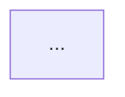

<template name="service">
# {SERVICE NAME}

{Service Description}

## Methods

<!-- For each method in the service -->
### {methodName}

{Method Description}

#### Signature
```ts
interface {MethodName}Input {
  /*...fields*/
}

interface {MethodName}Output {
  /*...fields*/
}

function {methodName}(input: {MethodName}Input): Promise<{MethodName}Output>
```

#### Business Logic


#### Error Handling
| Error Code | Condition | Message |
|------------|-----------|---------|
| ... | ... | ... |

<!-- End for -->

## Dependencies
- [{ServiceName}](./{service-name}.md)
- [{ModelName}](../models/{model-name}.md)

## Relevant files
<!-- Relevant files from the legacy codebase -->
- [FileName.ext](relative/path/to/file/from/this/markdown/file)
- ...

</template>

<instructions>
controllers = globs("teardown/controllers/*.md")
models = globs("teardown/models/*.md")
controllers.read()

services = inferServices(controllers)

for (each service in services)
  file("./teardown/services/{service.name}.md").write(<template name="service" />, service)

file("./teardown/services.md").write(`
  - Overview of all services
  - Service dependency diagram (mermaid)
  - Service to Controller mapping table
`, services)
</instructions>.execute()
