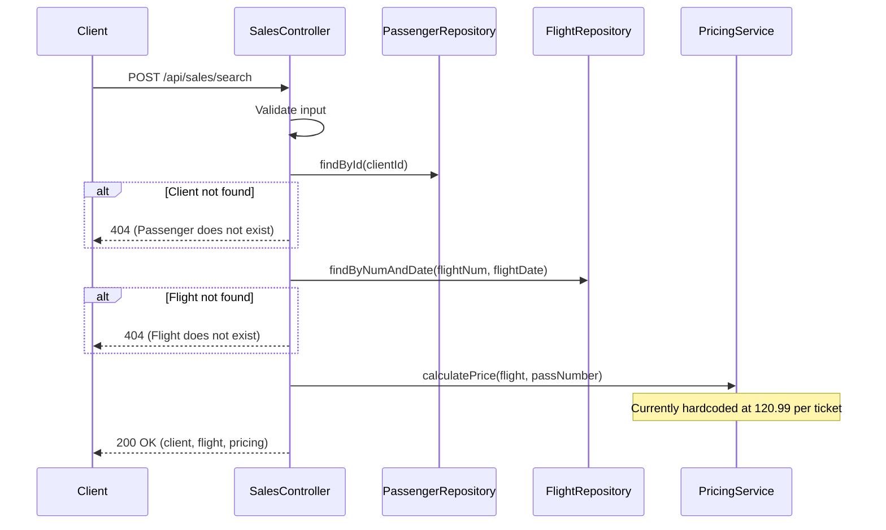
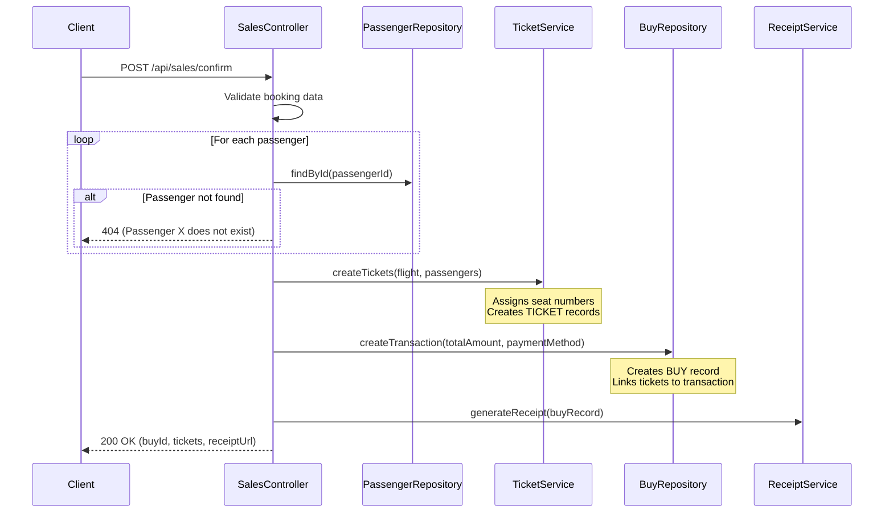

# SalesController

Manages the ticket sales workflow including client/flight search, price calculation, passenger selection, and purchase confirmation.

## Search Client and Flight

- URL: `/api/sales/search`
- Method: POST
- Description: Search for a client and flight, calculate pricing for the booking
- Content Type: application/json
- View: [sell1](../pages/sell1.md)

### Data model
```ts
declare namespace SearchClientFlight {
  export namespace Request {
    interface Body {
      clientId: string;       // Client/Passenger ID (6 digits)
      flightNum: string;      // Flight number
      flightDate: string;     // Flight date (YYYY-MM-DD)
      passNumber: number;     // Number of passengers (1-9)
    }
  }

  export namespace Response {
    export interface Body {
      client: {
        id: string;
        name: string;
      };
      flight: {
        flightNum: string;
        flightDate: string;
        depTime: string;
        landTime: string;
        depAirport: string;
        landAirport: string;
      };
      pricing: {
        pricePerTicket: number;
        totalPrice: number;
      };
      message?: string;
    }
  }
}
```

### Business Logic


### Relevant models
- [PASSENGERS](../models/PASSENGERS.md)
- [FLIGHT](../models/FLIGHT.md)

---

## Confirm Passengers

- URL: `/api/sales/confirm`
- Method: POST
- Description: Validate passengers, create tickets and purchase record
- Content Type: application/json
- View: [sell2](../pages/sell2.md)

### Data model
```ts
declare namespace ConfirmPassengers {
  export namespace Request {
    interface Body {
      clientId: string;           // Primary client ID
      flightNum: string;          // Selected flight number
      flightDate: string;         // Flight date
      passNumber: number;         // Total number of passengers
      passengers: Array<{
        clientId: string;         // Additional passenger ID
      }>;
      paymentMethod: 'CB' | 'CS' | 'CH';  // Card, Cash, Check
    }
  }

  export namespace Response {
    export interface Body {
      success: boolean;
      buyId: string;              // Transaction ID
      tickets: Array<{
        ticketId: string;
        passengerName: string;
        seatNumber: string;
      }>;
      totalAmount: number;
      receiptUrl: string;
    }
  }
}
```

### Business Logic


### Relevant models
- [PASSENGERS](../models/PASSENGERS.md)
- [FLIGHT](../models/FLIGHT.md)
- [TICKET](../models/TICKET.md)
- [BUY](../models/BUY.md)
