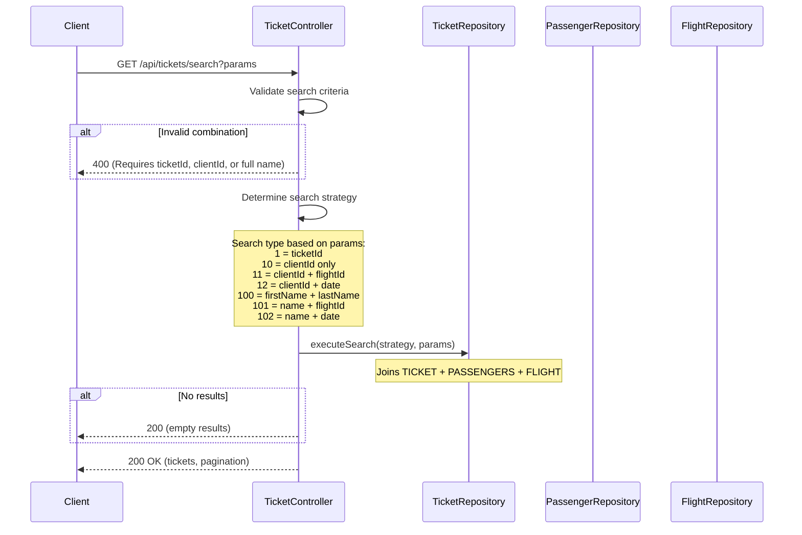
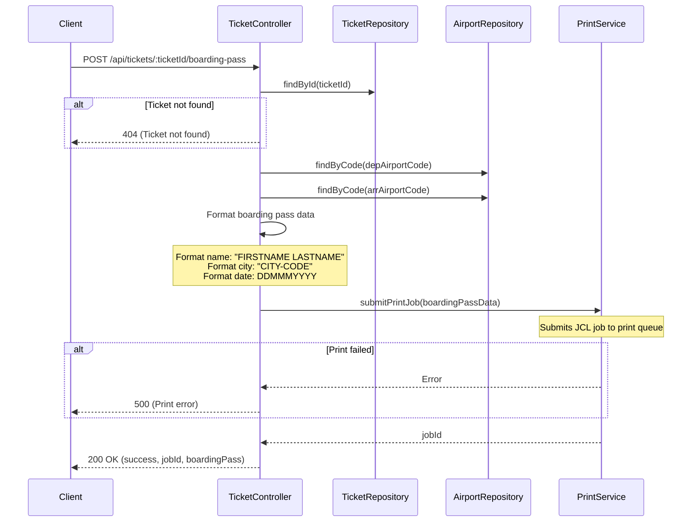

# TicketController

Handles ticket search operations and boarding pass generation. Supports multiple search criteria and pagination for results.

## Search Tickets

- URL: `/api/tickets/search`
- Method: GET
- Description: Search for existing tickets by various criteria including ticket ID, client ID, passenger name, or flight details
- Content Type: application/json
- View: [search-ticket](../pages/search-ticket.md)

### Data model
```ts
declare namespace SearchTickets {
  export namespace Request {
    interface Params {
      ticketId?: string;        // Ticket ID
      clientId?: string;        // Client/Passenger ID
      firstName?: string;       // Passenger first name
      lastName?: string;        // Passenger last name
      flightId?: string;        // Flight ID
      flightDate?: string;      // Flight date (YYYY-MM-DD)
      page?: number;            // Page number for pagination
    }
  }

  export namespace Response {
    export interface Body {
      tickets: Array<{
        ticketId: string;
        firstName: string;
        lastName: string;
        flightId: string;
        depTime: string;
        landTime: string;
        flightDate: string;
        depAirport: string;
        landAirport: string;
        seatNumber: string;
      }>;
      pagination: {
        currentPage: number;
        totalPages: number;
        totalResults: number;
      };
      message?: string;
    }
  }
}
```

### Business Logic


### Relevant models
- [TICKET](../models/TICKET.md)
- [PASSENGERS](../models/PASSENGERS.md)
- [FLIGHT](../models/FLIGHT.md)
- [AIRPORT](../models/AIRPORT.md)

---

## Print Boarding Pass

- URL: `/api/tickets/:ticketId/boarding-pass`
- Method: POST
- Description: Generate and print a boarding pass for a specific ticket
- Content Type: application/json
- View: [boarding-pass](../pages/boarding-pass.md)

### Data model
```ts
declare namespace PrintBoardingPass {
  export namespace Request {
    interface Params {
      ticketId: string;         // Ticket ID to print
    }
  }

  export namespace Response {
    export interface Body {
      success: boolean;
      jobId?: string;           // Print job ID
      boardingPass?: {
        passengerName: string;
        seatNumber: string;
        flightId: string;
        flightDate: string;
        departureTime: string;
        depAirportCode: string;
        arrAirportCode: string;
        depCityName: string;
        arrCityName: string;
      };
      message: string;
    }
  }
}
```

### Business Logic


### Relevant models
- [TICKET](../models/TICKET.md)
- [PASSENGERS](../models/PASSENGERS.md)
- [FLIGHT](../models/FLIGHT.md)
- [AIRPORT](../models/AIRPORT.md)
