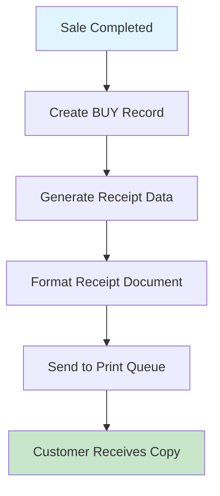

# RECEIPT

Purchase receipt output format for completed ticket transactions. This is a print document (not an interactive screen) generated after a successful ticket sale.

## Data model
```ts
interface ReceiptData {
  // Transaction info
  buyId: string;              // Transaction/Purchase ID
  paymentMethod: string;      // CB (Card), CS (Cash), CH (Check)
  transactionDate: string;    // Date (DD/MM/YYYY)
  transactionTime: string;    // Time (HH:MM:SS)

  // Company info
  companyName: string;        // "COBOL AIRLINES"
  city: string;               // "PARIS"
  postalCode: string;         // "75000"

  // Amount
  amount: number;             // Transaction amount in EUR
  transactionType: string;    // "DEBIT" or "CREDIT"
}
```

## Actions
- **print**: Send receipt to print queue (automatic after sale completion)

## Layout
```html
<document type="receipt">
  <header>
    <title>RECEIPT</title>
  </header>

  <section id="transaction-info">
    <field><label>Transaction ID</label><value>{buyId}</value></field>
    <field><label>Payment Method</label><value>{paymentMethod}</value></field>
    <field><label>Date/Time</label><value>{transactionDate} {transactionTime}</value></field>
  </section>

  <section id="company-info">
    <company>{companyName}</company>
    <address>
      <city>{city}</city>
      <postal>{postalCode}</postal>
    </address>
  </section>

  <divider>---------------------------</divider>

  <section id="amount">
    <field>
      <label>MONTANT</label>
      <value>{amount} EUR</value>
    </field>
    <field>
      <label>Type</label>
      <value>{transactionType}</value>
    </field>
  </section>

  <footer>
    <notice>TICKET CLIENT</notice>
    <instruction>TO KEEP</instruction>
  </footer>
</document>
```

## Business Logic
```gherkin
Feature: Receipt Generation

Scenario: Generate receipt after sale
  Given a ticket sale is completed successfully
  When the receipt is generated
  Then populate transaction details from BUY record
  And format amount in EUR
  And mark as DEBIT transaction

Scenario: Include payment method
  Given the sale specifies a payment method
  When the receipt is generated
  Then display payment method code:
    | Code | Meaning      |
    | CB   | Credit Card  |
    | CS   | Cash         |
    | CH   | Check        |

Scenario: Print receipt
  Given the receipt is generated
  When sent to printer
  Then output to configured print class
  And provide customer copy
```

## User Flow


## Relevant files
- [RECEIPT-FORMAT](../../COBOL-AIRLINES/CICS/SALES-MAP/RECEIPT-FORMAT) - Receipt template format
- [RECEIPT-COB](../../COBOL-AIRLINES/CICS/SALES-MAP/RECEIPT-COB) - Receipt generation program
- [BUY](../../COBOL-AIRLINES/DB2/DCLGEN/BUY) - Buy/transaction table DCLGEN
