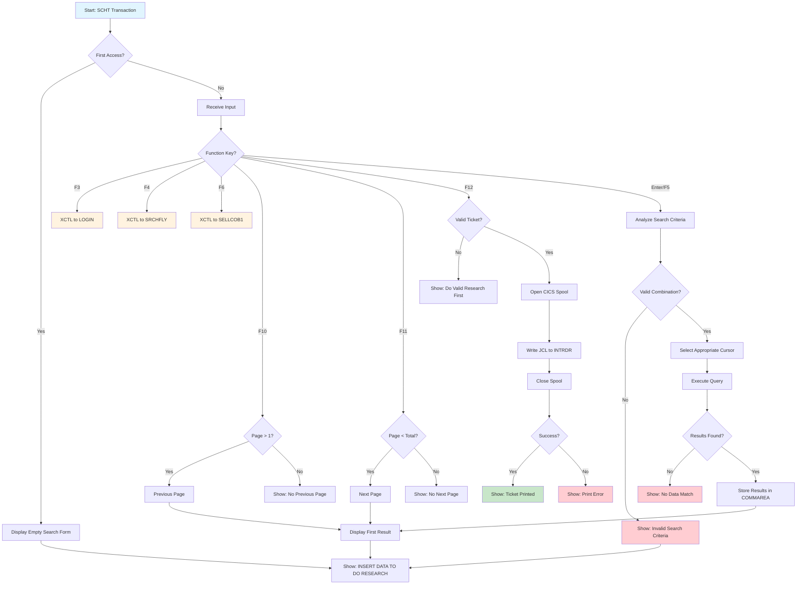

# SEARCH TICKET

Ticket search screen allowing agents to find existing tickets by multiple criteria including ticket ID, client ID, passenger name, flight ID, or flight date. Displays detailed ticket information with pagination support.

## Data model
```ts
interface SearchTicketData {
  // Header info
  userid: string;
  terminal: string;
  currentDate: string;
  currentTime: string;

  // Search criteria (input)
  ticketId: string;         // Ticket ID
  clientId: string;         // Client/Passenger ID
  firstName: string;        // Passenger first name
  lastName: string;         // Passenger last name
  flightId: string;         // Flight ID
  flightDate: string;       // Flight date (YYYY-MM-DD)

  // Search result (single ticket display)
  result: {
    ticketId: string;
    firstName: string;
    lastName: string;
    flightId: string;
    depTime: string;
    landTime: string;
    flightDate: string;
    depAirport: string;
    landAirport: string;
    seatNumber: string;
  };

  // Pagination
  currentPage: number;
  totalPages: number;

  // Messages
  message1: string;
  message2: string;
}
```

## Actions
- **search**: Search tickets based on criteria (ticket ID, client ID, name, flight)
- **prevPage**: Navigate to previous result page
- **nextPage**: Navigate to next result page
- **printTicket**: Print boarding pass via JCL/INTRDR
- **exit**: Return to LOGIN screen
- **searchFlight**: Navigate to Flight Search screen
- **sell**: Navigate to SELL1 screen

## Layout
```html
<screen>
  <header>
    <metadata>
      <userid>{userid}</userid>
      <terminal>{terminal}</terminal>
      <date>{currentDate}</date>
      <time>{currentTime}</time>
    </metadata>
    <title>COBOL AIRLINES - SEARCH TICKET</title>
  </header>

  <main>
    <section id="search-form">
      <form onsubmit="search">
        <field>
          <label>TICKET ID</label>
          <input name="ticketId" type="text" />
        </field>
        <field>
          <label>CLIENT ID</label>
          <input name="clientId" type="text" />
        </field>
        <field>
          <label>FIRST NAME</label>
          <input name="firstName" type="text" />
        </field>
        <field>
          <label>LAST NAME</label>
          <input name="lastName" type="text" />
        </field>
        <field>
          <label>FLIGHT ID</label>
          <input name="flightId" type="text" />
        </field>
        <field>
          <label>FLIGHT DATE</label>
          <input name="flightDate" type="date" placeholder="YYYY-MM-DD" />
        </field>
      </form>
    </section>

    <section id="result">
      <field><label>TICKET ID</label><value>{result.ticketId}</value></field>
      <field><label>FIRST NAME</label><value>{result.firstName}</value></field>
      <field><label>LAST NAME</label><value>{result.lastName}</value></field>
      <field><label>FLIGHT ID</label><value>{result.flightId}</value></field>
      <field><label>TIME DEP</label><value>{result.depTime}</value></field>
      <field><label>TIME LAND</label><value>{result.landTime}</value></field>
      <field><label>FLIGHT DATE</label><value>{result.flightDate}</value></field>
      <field><label>AIRPORT DEP</label><value>{result.depAirport}</value></field>
      <field><label>AIRPORT LAND</label><value>{result.landAirport}</value></field>
      <field><label>SEAT NUMBER</label><value>{result.seatNumber}</value></field>
      <pagination>({currentPage}/{totalPages})</pagination>
    </section>

    <section id="actions">
      <button onclick="exit">F3: EXIT</button>
      <button onclick="searchFlight">F4: SEARCH FLIGHT</button>
      <button onclick="search">F5: SEARCH TICKET</button>
      <button onclick="sell">F6: SELL</button>
      <button onclick="prevPage">F10: PREV</button>
      <button onclick="nextPage">F11: NEXT</button>
      <button onclick="printTicket">F12: PRINT TKT</button>
    </section>
  </main>

  <footer>
    <messages>
      <message>{message1}</message>
      <message>{message2}</message>
    </messages>
  </footer>
</screen>
```

## Business Logic
```gherkin
Feature: Ticket Search

Scenario: Search by ticket ID
  Given the agent enters TICKET ID
  When the search is executed
  Then query using CSR1 cursor (TICKET + PASSENGERS + FLIGHT join)
  And return the matching ticket

Scenario: Search by client ID
  Given the agent enters CLIENT ID only
  When the search is executed
  Then query using CSR10 cursor
  And return all tickets for that client

Scenario: Search by client ID and flight number
  Given the agent enters CLIENT ID and FLIGHT ID
  When the search is executed
  Then query using CSR11 cursor
  And return matching tickets

Scenario: Search by client ID and date
  Given the agent enters CLIENT ID and FLIGHT DATE
  When the search is executed
  Then query using CSR12 cursor
  And return matching tickets

Scenario: Search by passenger name
  Given the agent enters FIRST NAME and LAST NAME
  When the search is executed
  Then query using CSR100 cursor
  And return all tickets for that passenger

Scenario: Search by name and flight number
  Given the agent enters name and FLIGHT ID
  When the search is executed
  Then query using CSR101 cursor
  And return matching tickets

Scenario: Search by name and date
  Given the agent enters name and FLIGHT DATE
  When the search is executed
  Then query using CSR102 cursor
  And return matching tickets

Scenario: Invalid search combination
  Given the agent enters an invalid combination of criteria
  When the search is executed
  Then display "A VALID RESEARCH MUST HAVE AT LEAST: TICKETID OR CLIENTID OR CLIENT'S FIRST AND LAST NAME"

Scenario: Navigate pages
  Given multiple results are found
  When the agent presses F10 or F11
  Then navigate to previous/next page
  And update display with corresponding ticket

Scenario: Print ticket
  Given a valid ticket is displayed
  When the agent presses F12
  Then submit JCL job to INTRDR
  And print boarding pass document
  And display "TICKET SUCCESSFULLY PRINTED"

Scenario: Print error
  Given ticket printing fails
  When the CICS spool operation fails
  Then display "ERROR IN THE PRINT PROCESS"
```

## Form validation
```ts
const schema = z4.object({
  ticketId: z4.string().optional(),
  clientId: z4.string()
    .regex(/^\d+$/, "CLIENT ID must be numeric")
    .optional(),
  firstName: z4.string().optional(),
  lastName: z4.string().optional(),
  flightId: z4.string().optional(),
  flightDate: z4.string()
    .regex(/^\d{4}-\d{2}-\d{2}$/, "DATE must be YYYY-MM-DD format")
    .optional()
}).refine(
  data => data.ticketId ||
          data.clientId ||
          (data.firstName && data.lastName),
  "Search requires: TICKET ID, CLIENT ID, or both FIRST and LAST NAME"
);
```

## User Flow


## Relevant files
- [SRCHTKT-COB](../../COBOL-AIRLINES/CICS/SALES-MAP/SRCHTKT-COB) - Main COBOL program
- [SRCHTKT-MAP](../../COBOL-AIRLINES/CICS/SALES-MAP/SRCHTKT-MAP) - BMS map definition
- [TICKET](../../COBOL-AIRLINES/DB2/DCLGEN/TICKET) - Ticket table DCLGEN
- [PASSENG](../../COBOL-AIRLINES/DB2/DCLGEN/PASSENG) - Passengers table DCLGEN
- [FLIGHT](../../COBOL-AIRLINES/DB2/DCLGEN/FLIGHT) - Flight table DCLGEN
- [AIRPORT](../../COBOL-AIRLINES/DB2/DCLGEN/AIRPORT) - Airport table DCLGEN
