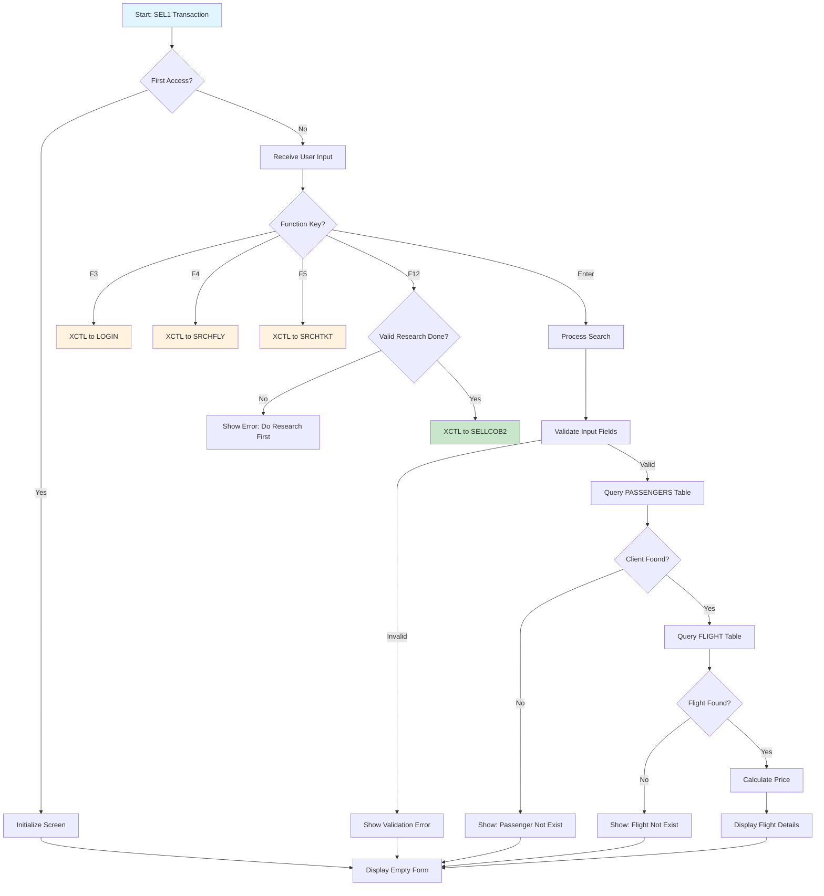

# SELL1

Initial sales screen for ticket booking. Allows sales agents to search for a client, select a flight, specify number of passengers, and view pricing before proceeding to passenger confirmation.

## Data model
```ts
interface Sell1Data {
  // Header info
  userid: string;         // Current user ID
  terminal: string;       // Terminal ID
  currentDate: string;    // System date
  currentTime: string;    // System time

  // Input fields
  clientId: string;       // Client/Passenger ID (6 digits)
  flightNum: string;      // Flight number (6 chars)
  flightDate: string;     // Flight date (YYYY-MM-DD)
  passNumber: number;     // Number of passengers (1 digit)

  // Display fields (from search results)
  selectedFlightNum: string;    // Selected flight number
  selectedFlightDate: string;   // Selected flight date
  depTime: string;              // Departure time
  landTime: string;             // Landing/arrival time
  depAirport: string;           // Departure airport code
  landAirport: string;          // Landing airport code
  price: number;                // Price per ticket
  totalPrice: number;           // Total price (price × passengers)

  // Messages
  message1: string;
  message2: string;
}
```

## Actions
- **search**: Search for client and flight, calculate pricing
- **exit**: Return to LOGIN screen
- **searchFlight**: Navigate to Flight Search screen
- **searchTicket**: Navigate to Ticket Search screen
- **insertPassengers**: Proceed to passenger confirmation (SELL2)

## Layout
```html
<screen>
  <header>
    <metadata>
      <userid>{userid}</userid>
      <terminal>{terminal}</terminal>
      <date>{currentDate}</date>
      <time>{currentTime}</time>
    </metadata>
    <title>COBOL AIRLINES - SELL</title>
  </header>

  <main>
    <section id="input">
      <form onsubmit="search">
        <field>
          <label>CLIENT ID</label>
          <input name="clientId" type="text" />
        </field>
        <field>
          <label>FLIGHT NUM</label>
          <input name="flightNum" type="text" />
        </field>
        <field>
          <label>DATE</label>
          <input name="flightDate" type="date" placeholder="YYYY-MM-DD" />
        </field>
        <field>
          <label>PASS NUMBER</label>
          <input name="passNumber" type="number" min="1" max="9" />
        </field>
      </form>
    </section>

    <section id="flight-details">
      <field><label>FLIGHT NUM</label><value>{selectedFlightNum}</value></field>
      <field><label>DATE</label><value>{selectedFlightDate}</value></field>
      <field><label>DEP TIME</label><value>{depTime}</value></field>
      <field><label>LAND TIME</label><value>{landTime}</value></field>
      <field><label>DEP AIRPORT</label><value>{depAirport}</value></field>
      <field><label>LAND AIRPORT</label><value>{landAirport}</value></field>
      <field><label>PRICE</label><value>{price}</value></field>
      <field><label>TOTAL PRICE</label><value>{totalPrice}</value></field>
    </section>

    <section id="actions">
      <button onclick="exit">F3: EXIT</button>
      <button onclick="searchFlight">F4: SEARCH FLIGHT</button>
      <button onclick="searchTicket">F5: SEARCH TICKET</button>
      <button onclick="insertPassengers">F12: INSERT PASSENGERS</button>
    </section>
  </main>

  <footer>
    <messages>
      <message>{message1}</message>
      <message>{message2}</message>
    </messages>
  </footer>
</screen>
```

## Business Logic
```gherkin
Feature: Ticket Sales - Initial Screen

Scenario: Search for client
  Given the agent enters a CLIENT ID
  When the system queries the PASSENGERS table
  And the client exists
  Then display client information

Scenario: Client not found
  Given the agent enters a CLIENT ID
  When the system queries the PASSENGERS table
  And the client does not exist
  Then display message "THIS PASSENGER DOES NOT EXIST"

Scenario: Search for flight
  Given the agent enters FLIGHT NUM and DATE
  When the system queries the FLIGHT table
  And the flight exists
  Then display flight details (times, airports)
  And calculate price based on passenger count

Scenario: Flight not found
  Given the agent enters FLIGHT NUM and DATE
  When the system queries the FLIGHT table
  And the flight does not exist
  Then display message "THIS FLIGHT DOES NOT EXIST"

Scenario: Calculate total price
  Given a valid flight is selected
  And the agent enters PASS NUMBER
  When the price is calculated
  Then TOTAL PRICE = PRICE × PASS NUMBER
  # Note: Price is hardcoded at 120.99 (pricing program not implemented)

Scenario: Proceed to passenger selection
  Given a valid client and flight are selected
  When the agent presses F12
  Then transfer to SELL2 screen (SELLCOB2)
  And pass all selection data via COMMAREA

Scenario: Navigate to other screens
  Given the agent presses a function key
  Then:
    | Key | Action                          |
    | F3  | Return to LOGIN                 |
    | F4  | Go to Flight Search (SRCHFLY)   |
    | F5  | Go to Ticket Search (SRCHTKT)   |
    | F6  | Stay on current screen          |
    | F7  | Passenger Registration (N/A)    |
```

## Form validation
```ts
const schema = z4.object({
  clientId: z4.string()
    .regex(/^\d{6}$/, "CLIENT ID must be 6 digits"),
  flightNum: z4.string()
    .min(1, "FLIGHT NUM is required"),
  flightDate: z4.string()
    .regex(/^\d{4}-\d{2}-\d{2}$/, "DATE must be YYYY-MM-DD format"),
  passNumber: z4.number()
    .int()
    .min(1, "Must have at least 1 passenger")
    .max(9, "Maximum 9 passengers")
});
```

## User Flow


## Relevant files
- [SELL1-COB](../../COBOL-AIRLINES/CICS/SALES-MAP/SELL1-COB) - Main COBOL program
- [SELL1-MAP](../../COBOL-AIRLINES/CICS/SALES-MAP/SELL1-MAP) - BMS map definition
- [PASSENG](../../COBOL-AIRLINES/DB2/DCLGEN/PASSENG) - Passengers table DCLGEN
- [FLIGHT](../../COBOL-AIRLINES/DB2/DCLGEN/FLIGHT) - Flight table DCLGEN
