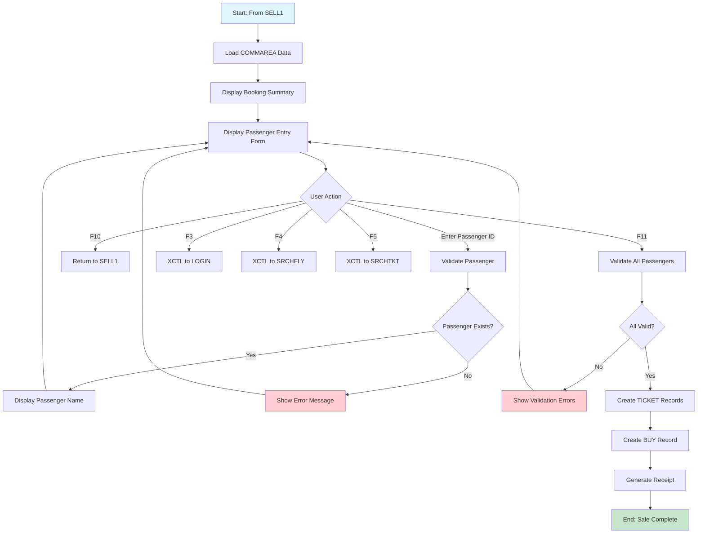

# SELL2

Passenger confirmation screen for finalizing ticket sales. Displays booking summary with flight details and allows entry of up to 8 additional passenger IDs before confirming the purchase.

## Data model
```ts
interface Sell2Data {
  // Header info
  userid: string;
  terminal: string;
  currentDate: string;
  currentTime: string;

  // Booking summary (read-only, from SELL1)
  clientId: string;           // Primary client ID
  flightNum: string;          // Selected flight number
  depAirport: string;         // Departure airport code
  landAirport: string;        // Landing airport code
  flightDate: string;         // Flight date
  passNumber: number;         // Number of passengers
  price: number;              // Price per ticket
  totalPrice: number;         // Total price

  // Passenger list (up to 8 additional passengers)
  passengers: Array<{
    clientId: string;         // Passenger client ID (input)
    name: string;             // Passenger name (display)
  }>;

  // Messages
  message1: string;
  message2: string;
}
```

## Actions
- **confirmPassengers**: Validate passengers, create tickets and BUY record, generate receipt
- **return**: Return to SELL1 screen
- **exit**: Return to LOGIN screen
- **searchFlight**: Navigate to Flight Search screen
- **searchTicket**: Navigate to Ticket Search screen

## Layout
```html
<screen>
  <header>
    <metadata>
      <userid>{userid}</userid>
      <terminal>{terminal}</terminal>
      <date>{currentDate}</date>
      <time>{currentTime}</time>
    </metadata>
    <title>COBOL AIRLINES - SELL</title>
  </header>

  <main>
    <section id="booking-summary">
      <field><label>CLIENT ID</label><value>{clientId}</value></field>
      <field><label>FLIGHT NUM</label><value>{flightNum}</value></field>
      <field><label>AIRPORT DEP</label><value>{depAirport}</value></field>
      <field><label>AIRPORT LAND</label><value>{landAirport}</value></field>
      <field><label>DATE</label><value>{flightDate}</value></field>
      <field><label>PASS NUMBER</label><value>{passNumber}</value></field>
      <field><label>PRICE</label><value>{price}</value></field>
      <field><label>TOT PRICE</label><value>{totalPrice}</value></field>
    </section>

    <section id="passenger-list">
      <table>
        <header>
          <column>CLIENT ID</column>
          <column>NAME</column>
        </header>
        <rows repeat="8">
          <row>
            <input name="passengers[].clientId" type="text" />
            <value>{passengers[].name}</value>
          </row>
        </rows>
      </table>
    </section>

    <section id="actions">
      <button onclick="exit">F3: EXIT</button>
      <button onclick="searchFlight">F4: SEARCH FLIGHT</button>
      <button onclick="searchTicket">F5: SEARCH TICKET</button>
      <button onclick="return">F10: RETURN</button>
      <button onclick="confirmPassengers">F11: CONFIRM PASSENGERS</button>
    </section>
  </main>

  <footer>
    <messages>
      <message>{message1}</message>
      <message>{message2}</message>
    </messages>
  </footer>
</screen>
```

## Business Logic
```gherkin
Feature: Ticket Sales - Passenger Confirmation

Scenario: Display booking summary
  Given the user arrives from SELL1 screen
  When the screen is displayed
  Then show all booking details from COMMAREA
  And display empty passenger entry fields

Scenario: Add additional passengers
  Given the booking allows multiple passengers
  When the agent enters passenger CLIENT IDs
  Then validate each passenger exists in PASSENGERS table
  And display passenger name next to ID

Scenario: Confirm passengers and complete sale
  Given all required passengers are entered
  When the agent presses F11
  Then validate all passenger entries
  And create TICKET records for each passenger
  And create BUY transaction record
  And proceed to receipt generation

Scenario: Return to previous screen
  Given the agent wants to modify the booking
  When the agent presses F10
  Then return to SELL1 screen
  And preserve entered data

Scenario: Navigate to other screens
  Given the agent presses a function key
  Then:
    | Key | Action                          |
    | F3  | Return to LOGIN                 |
    | F4  | Go to Flight Search (SRCHFLY)   |
    | F5  | Go to Ticket Search (SRCHTKT)   |
    | F6  | Go to SELL1                     |
    | F10 | Return to SELL1                 |
    | F11 | Confirm and finalize sale       |
```

## Form validation
```ts
const passengerSchema = z4.object({
  clientId: z4.string()
    .regex(/^\d{6}$/, "CLIENT ID must be 6 digits")
    .optional()
});

const schema = z4.object({
  passengers: z4.array(passengerSchema)
    .max(8, "Maximum 8 additional passengers")
});
```

## User Flow


## Relevant files
- [SELL1-COB](../../COBOL-AIRLINES/CICS/SALES-MAP/SELL1-COB) - Main COBOL program (handles SELL2)
- [SELL2-MAP](../../COBOL-AIRLINES/CICS/SALES-MAP/SELL2-MAP) - BMS map definition
- [PASSENG](../../COBOL-AIRLINES/DB2/DCLGEN/PASSENG) - Passengers table DCLGEN
- [TICKET](../../COBOL-AIRLINES/DB2/DCLGEN/TICKET) - Ticket table DCLGEN
- [BUY](../../COBOL-AIRLINES/DB2/DCLGEN/BUY) - Buy/transaction table DCLGEN
