# PricingService

Calculates ticket prices for flight bookings. Currently implements a simplified flat-rate pricing model with plans for dynamic pricing based on flight details.

## Methods

### calculatePrice

Calculates the price for a flight booking based on the number of passengers.

#### Signature
```ts
interface CalculatePriceInput {
  flightId: number;      // Flight identifier
  flightNum: string;     // Flight number
  flightDate: string;    // Flight date (YYYY-MM-DD)
  passengerCount: number; // Number of passengers (1-9)
}

interface CalculatePriceOutput {
  pricePerTicket: number;  // Price per individual ticket (EUR)
  totalPrice: number;      // Total price for all passengers (EUR)
  currency: string;        // Currency code (EUR)
}

function calculatePrice(input: CalculatePriceInput): Promise<CalculatePriceOutput>
```

#### Business Logic

```mermaid
flowchart TD
    A[Start] --> B[Receive flight and passenger info]
    B --> C[Get base ticket price]
    C --> D{Dynamic pricing enabled?}
    D -->|No| E[Use flat rate: 120.99 EUR]
    D -->|Yes| F[Calculate dynamic price]
    F --> G[Consider flight demand]
    G --> H[Consider booking date proximity]
    H --> I[Consider seat availability]
    E --> J[Calculate total price]
    I --> J
    J --> K[totalPrice = pricePerTicket × passengerCount]
    K --> L[Return pricing details]

    style D fill:#ffcccc
    style F fill:#cccccc
    style G fill:#cccccc
    style H fill:#cccccc
    style I fill:#cccccc
```


> **Note**: The COBOL source indicates dynamic pricing is not yet implemented. The current implementation uses a hardcoded flat rate of 120.99 EUR per ticket.

#### Error Handling
| Error Code | Condition | Message |
|------------|-----------|---------|
| INVALID_PASSENGER_COUNT | passengerCount < 1 or > 9 | Invalid number of passengers |
| FLIGHT_NOT_FOUND | Flight doesn't exist | Flight does not exist |

## Future Enhancements

The following pricing factors are planned but not yet implemented:

1. **Demand-based pricing**: Adjust prices based on booking volume
2. **Date proximity**: Higher prices closer to flight date
3. **Seat class**: Different prices for different seat classes
4. **Route-based pricing**: Variable prices based on distance/route
5. **Seasonal adjustments**: Peak/off-peak pricing

## Dependencies
- [FlightRepository](../models/FLIGHT.md) - For flight details (future dynamic pricing)

## Relevant files
- [SELL1-COB](../../COBOL-AIRLINES/CICS/SALES-MAP/SELL1-COB) - Sales program containing pricing logic (line 436)
