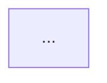

<template name="fixture">
# {MODEL NAME} Fixtures

## Source
- [FileName.ext](relative/path/to/file/from/this/markdown/file)

## Row Schema
```ts
interface Row {
  /*...fields*/
}
```

## Relevant files
<!-- Relevant files from the legacy codebase -->
- [FileName.ext](relative/path/to/file/from/this/markdown/file)
- ...

</template>

<template name="seed-order">
# Seed Order

Tables must be seeded in this order to satisfy foreign key constraints.

## Dependency Graph


## Seed Order
1. {Independent tables first}
2. {Tables with FK dependencies}
...

</template>

<instructions>
fixtures = CobolProject.find(fixtures)
models = globs("teardown/models/*.md")
models.read()

fixtureOrder = topologicalSort(fixtures)

for (each fixture in fixtureOrder)
  file("./teardown/fixtures/{fixture.name}.fixtures.md").write(<template name="fixture" />, fixture)

file("./teardown/fixtures.md").write(<template name="seed-order" />, fixtureOrder)
</instructions>.execute()
