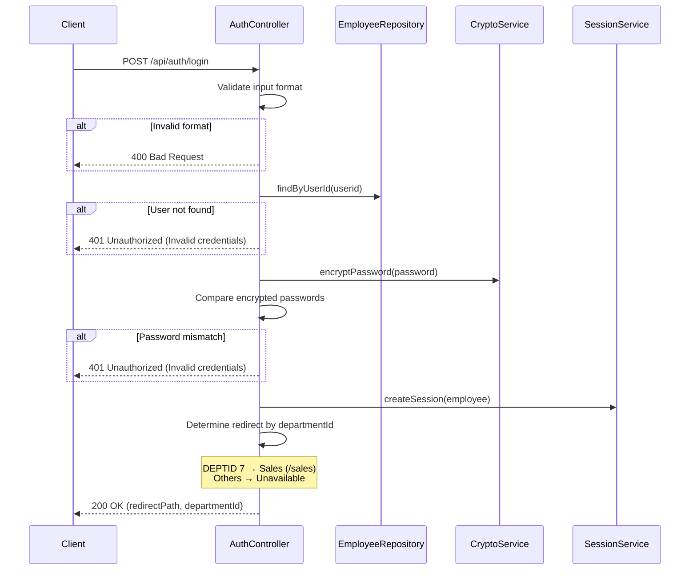

# AuthController

Handles user authentication and session management for the COBOL Airlines system. Validates employee credentials and routes users to their department-specific interfaces.

## Login

- URL: `/api/auth/login`
- Method: POST
- Description: Authenticate user credentials against employee database and route to appropriate department
- Content Type: application/json
- View: [login](../pages/login.md)

### Data model
```ts
declare namespace Login {
  export namespace Request {
    interface Body {
      userid: string;     // Employee ID (8 chars, alphanumeric)
      password: string;   // Password (8 chars, will be encrypted)
    }
  }

  export namespace Response {
    export interface Body {
      success: boolean;
      departmentId: number;
      redirectPath: string;
      message?: string;
    }
  }
}
```

### Business Logic


### Relevant models
- [EMPLO](../models/EMPLO.md)
- [DEPT](../models/DEPT.md)
