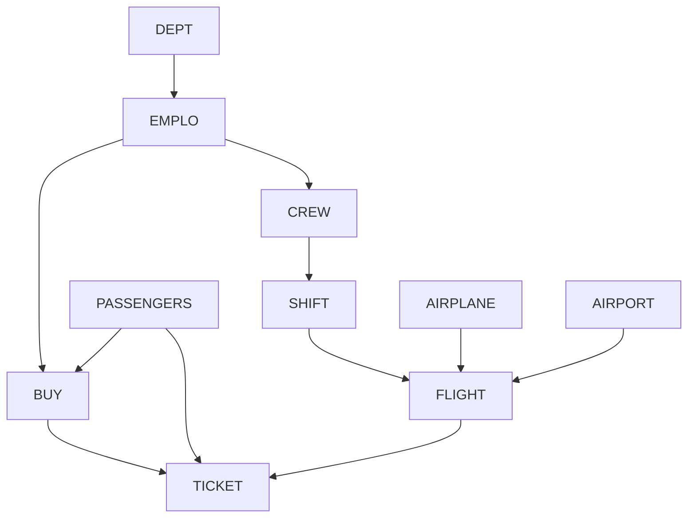

# Seed Order

Tables must be seeded in this order to satisfy foreign key constraints.

## Dependency Graph

## Seed Order

### Phase 1: Independent Tables
1. **[DEPT](./fixtures/DEPT.fixtures.md)** - Department reference data (9 departments)
2. **[AIRPORT](./fixtures/AIRPORT.fixtures.md)** - Airport reference data (9 airports)
3. **[AIRPLANE](./fixtures/AIRPLANE.fixtures.md)** - Aircraft reference data (10 airplanes)
4. **[PASSENGERS](./fixtures/PASSENGERS.fixtures.md)** - Customer master data (100+ passengers)

### Phase 2: Employee Data
5. **[EMPLO](./fixtures/EMPLO.fixtures.md)** - Employee master data (39 employees)
   - Depends on: DEPT
   - Note: After EMPLO insert, update DEPT.MANAGER fields

### Phase 3: Crew & Schedule
6. **[CREW](./fixtures/CREW.fixtures.md)** - Crew composition (4 crews)
   - Depends on: EMPLO
7. **[SHIFT](./fixtures/SHIFT.fixtures.md)** - Shift schedules (4 shifts)
   - Depends on: CREW

### Phase 4: Flight Data
8. **[FLIGHT](./fixtures/FLIGHT.fixtures.md)** - Flight schedule (8 flights)
   - Depends on: SHIFT, AIRPLANE, AIRPORT

### Phase 5: Transaction Data
9. **[BUY](./fixtures/BUY.fixtures.md)** - Purchase transactions (1 record)
   - Depends on: EMPLO, PASSENGERS
10. **[TICKET](./fixtures/TICKET.fixtures.md)** - Tickets (1 record)
    - Depends on: BUY, PASSENGERS, FLIGHT

## Data Sources

| Table      | Primary Source                          | Secondary Sources              |
|------------|----------------------------------------|--------------------------------|
| DEPT       | insertion-1                            | insertion-2 (manager updates)  |
| AIRPORT    | insertion-2                            | insertion-3                    |
| AIRPLANE   | insertion-2                            | insertion-3                    |
| PASSENGERS | AS-400/Insert/Passagers-file (CSV)     | insertion-2                    |
| EMPLO      | AS-400/Insert/Emplo-file (CSV)         | insertion-3                    |
| CREW       | insertion-2                            | insertion-3                    |
| SHIFT      | insertion-2                            | insertion-3                    |
| FLIGHT     | insertion-2                            | insertion-3                    |
| BUY        | insertion-2                            | Runtime (CICS)                 |
| TICKET     | insertion-2                            | Runtime (CICS)                 |

## Notes

- **Circular dependency**: DEPT.MANAGER references EMPLO.EMPID, but EMPLO.DEPTID references DEPT.DEPTID. Resolution: Insert DEPT without managers first, insert EMPLO, then UPDATE DEPT with manager assignments.
- **Runtime data**: BUY and TICKET tables are primarily populated at runtime through CICS sales transactions. The seed data provides minimal test records.
- **CSV imports**: EMPLO and PASSENGERS have dedicated COBOL programs (INSERTCSV, PASSENGER-INSERT) that read from CSV files and handle data transformation.
