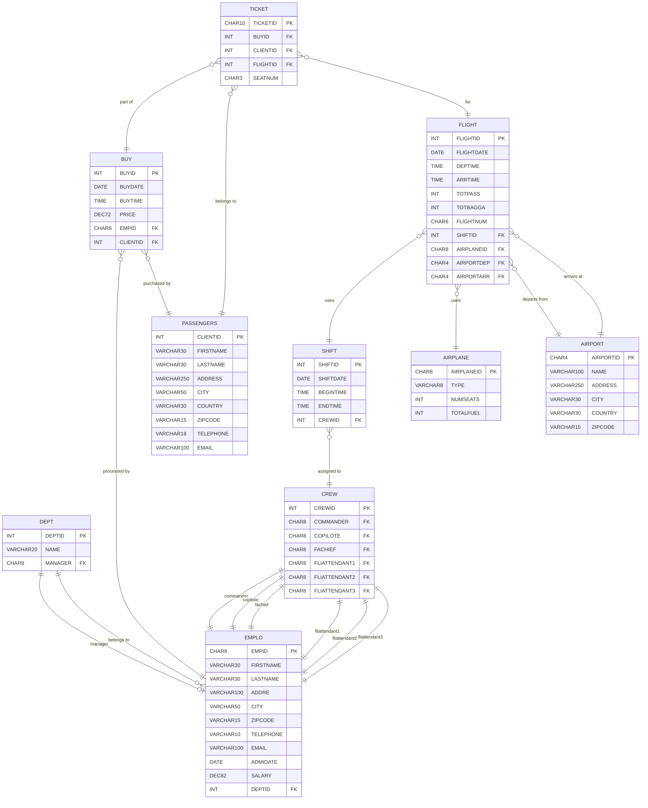

# Database Models

This document provides an overview of all database tables in the COBOL-AIRLINES system.

## Entity Relationship Diagram

## Tables

| Table | Description |
|-------|-------------|
| [AIRPORT](./AIRPORT.md) | Reference table containing airport information including location details |
| [AIRPLANE](./AIRPLANE.md) | Reference table containing aircraft information including type, capacity, and fuel |
| [DEPT](./DEPT.md) | Department reference table defining organizational units and their managers |
| [EMPLO](./EMPLO.md) | Employee master table containing staff personal information and employment data |
| [PASSENGERS](./PASSENGERS.md) | Customer master table containing passenger personal and contact information |
| [CREW](./CREW.md) | Flight crew composition table defining staff assignments for each crew unit |
| [SHIFT](./SHIFT.md) | Work shift schedule table linking crew assignments to specific dates and times |
| [FLIGHT](./FLIGHT.md) | Core transaction table storing flight schedule information including routes and timing |
| [BUY](./BUY.md) | Purchase transaction table recording ticket sales |
| [TICKET](./TICKET.md) | Transaction table linking passengers to specific flights and purchases |

## Table Categories

### Reference Tables
- **AIRPORT** - Airport locations
- **AIRPLANE** - Aircraft fleet
- **DEPT** - Organizational departments

### Master Tables
- **EMPLO** - Employee records
- **PASSENGERS** - Customer records

### Operational Tables
- **CREW** - Crew compositions
- **SHIFT** - Work schedules
- **FLIGHT** - Flight schedules

### Transaction Tables
- **BUY** - Purchase transactions
- **TICKET** - Individual tickets
