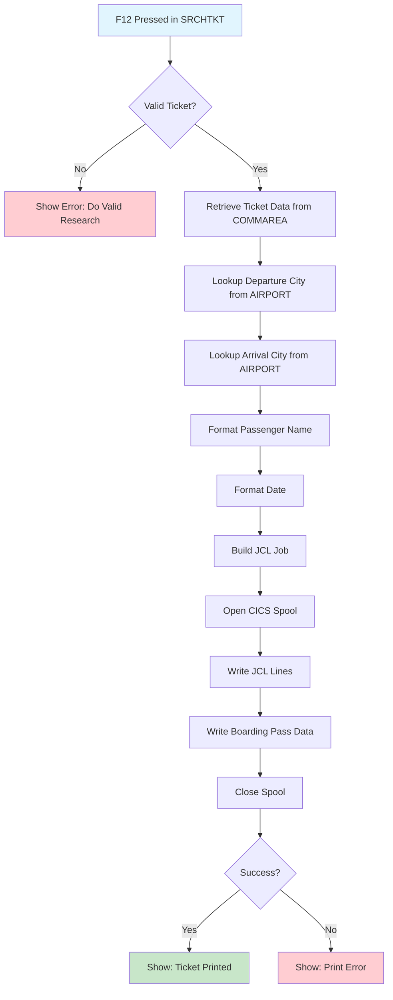

# BOARDING PASS

Boarding pass/ticket output format printed for passengers. This is a print document (not an interactive screen) containing flight and passenger details needed for boarding.

## Data model
```ts
interface BoardingPassData {
  // Passenger info
  passengerName: string;      // Full passenger name
  seatNumber: string;         // Seat assignment (e.g., "B04")

  // Flight info
  flightId: string;           // Flight number (e.g., "CB2004")
  flightDate: string;         // Flight date
  departureTime: string;      // Departure time

  // Route info
  depAirportCode: string;     // Departure airport code (e.g., "CDG")
  arrAirportCode: string;     // Arrival airport code (e.g., "FCO")
  depCityName: string;        // Full departure city (e.g., "PARIS-CDG")
  arrCityName: string;        // Full arrival city (e.g., "ROME-FCO")
}
```

## Actions
- **print**: Generate boarding pass and submit to print queue via JCL/INTRDR

## Layout
```html
<document type="boarding-pass">
  <section id="main-pass">
    <header>
      <title>BOARDING PASS</title>
      <company>COBOL AIRLINES</company>
    </header>

    <section id="passenger">
      <field>
        <label>PASSENGER NAME</label>
        <value>{passengerName}</value>
      </field>
      <field>
        <label>SEAT</label>
        <value>{seatNumber}</value>
      </field>
    </section>

    <section id="route">
      <field>
        <label>FROM</label>
        <value>{depCityName}</value>
      </field>
      <field>
        <label>TO</label>
        <value>{arrCityName}</value>
      </field>
    </section>

    <section id="flight-details">
      <field>
        <label>FLIGHT</label>
        <value>{flightId}</value>
      </field>
      <field>
        <label>DATE</label>
        <value>{flightDate}</value>
      </field>
      <field>
        <label>DEPARTURE</label>
        <value>{departureTime}</value>
      </field>
    </section>
  </section>

  <divider>|</divider>

  <section id="stub">
    <field><value>{passengerName}</value></field>
    <field>
      <label>FROM</label><value>{depAirportCode}</value>
      <label>TO</label><value>{arrAirportCode}</value>
    </field>
    <field><label>FLIGHT</label><value>{flightId}</value></field>
    <field><label>DATE</label><value>{flightDate}</value></field>
    <field><label>SEAT</label><value>{seatNumber}</value></field>
  </section>
</document>
```

## Business Logic
```gherkin
Feature: Boarding Pass Generation

Scenario: Generate boarding pass from ticket search
  Given a valid ticket is displayed in SRCHTKT screen
  When the agent presses F12 (PRINT TKT)
  Then retrieve ticket details from COMMAREA
  And lookup full city names from AIRPORT table
  And format boarding pass document
  And submit print job via JCL to INTRDR

Scenario: Format passenger name
  Given ticket has FIRSTNAME and LASTNAME
  When formatting boarding pass
  Then concatenate as "FIRSTNAME LASTNAME"

Scenario: Format city names
  Given route has airport codes
  When formatting boarding pass
  Then lookup CITY from AIRPORT table
  And format as "CITY-AIRPORTCODE" (e.g., "PARIS-CDG")

Scenario: Format date
  Given ticket has flight date in YYYY-MM-DD
  When formatting boarding pass
  Then convert to display format (DDMMMYYYY)
  # Example: 2022-09-01 becomes 01SEP2022

Scenario: Print via JCL
  Given boarding pass is formatted
  When submitting to print
  Then open CICS spool to INTRDR
  And write JCL job with print parameters
  And include boarding pass data in SYSIN
  And close spool to trigger job execution
```

## User Flow


## Relevant files
- [TICKET-FORMAT](../../COBOL-AIRLINES/CICS/SALES-MAP/TICKET-FORMAT) - Boarding pass template format
- [PRINT-TICKET-COB](../../COBOL-AIRLINES/CICS/SALES-MAP/PRINT-TICKET-COB) - Print ticket program
- [SRCHTKT-COB](../../COBOL-AIRLINES/CICS/SALES-MAP/SRCHTKT-COB) - Ticket search (triggers print)
- [TICKET](../../COBOL-AIRLINES/DB2/DCLGEN/TICKET) - Ticket table DCLGEN
- [AIRPORT](../../COBOL-AIRLINES/DB2/DCLGEN/AIRPORT) - Airport table DCLGEN (for city names)
