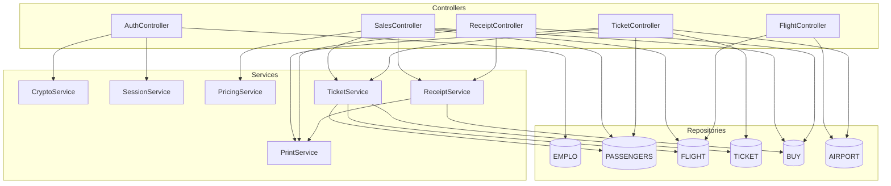
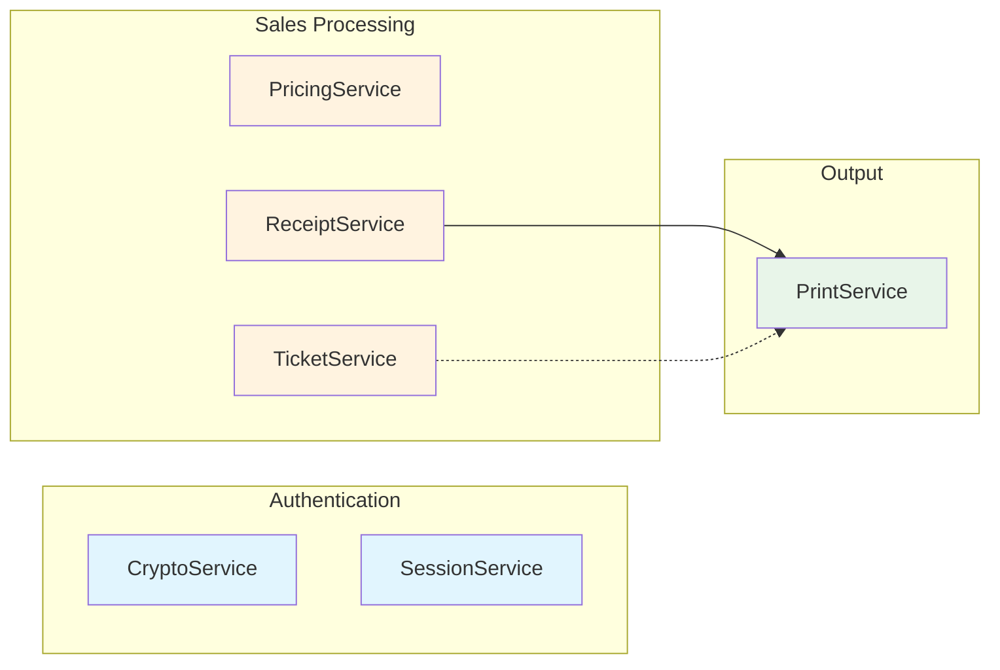
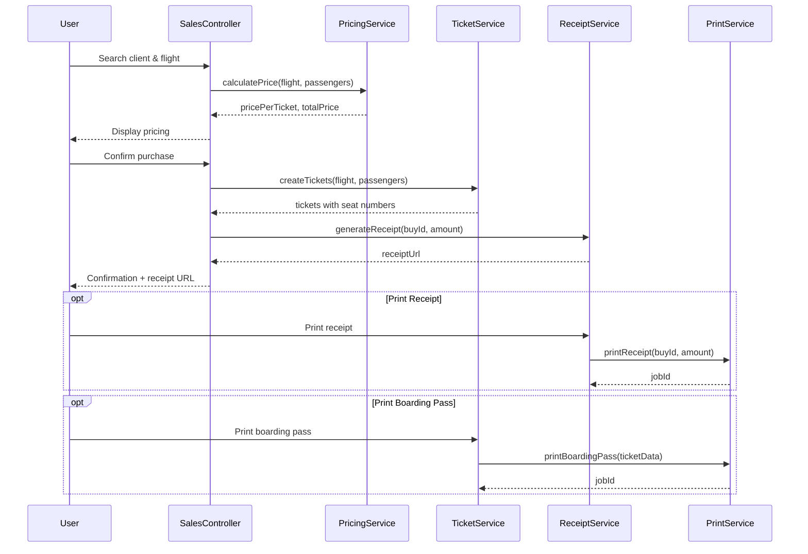

# Services Overview

This document provides an overview of all business logic services in the COBOL Airlines system. Services encapsulate reusable business logic that is shared across multiple controllers.

## Service Architecture

## Service Dependency Diagram

## Services

| Service | Description | Key Methods |
|---------|-------------|-------------|
| [CryptoService](./services/crypto-service.md) | Password encryption and verification | `encryptPassword`, `verifyPassword` |
| [SessionService](./services/session-service.md) | CICS session management via COMMAREA | `createSession`, `getSessionContext` |
| [PricingService](./services/pricing-service.md) | Ticket price calculation | `calculatePrice` |
| [TicketService](./services/ticket-service.md) | Ticket creation and management | `createTickets`, `getTicketDetails`, `formatBoardingPass` |
| [ReceiptService](./services/receipt-service.md) | Receipt generation and formatting | `generateReceipt`, `getReceipt`, `formatReceiptForPrint` |
| [PrintService](./services/print-service.md) | Document printing via JCL | `submitPrintJob`, `printBoardingPass`, `printReceipt` |

## Service to Controller Mapping

| Controller | Services Used |
|------------|---------------|
| AuthController | CryptoService, SessionService |
| SalesController | PricingService, TicketService, ReceiptService |
| FlightController | (none - direct repository access) |
| TicketController | TicketService, PrintService |
| ReceiptController | ReceiptService, PrintService |

## Service Responsibilities

### Authentication Layer
- **CryptoService**: Handles password encryption using a deterministic algorithm based on user ID and admin date. Used during employee onboarding and login verification.
- **SessionService**: Manages CICS pseudo-conversational sessions through DFHCOMMAREA, enabling state persistence between user interactions.

### Sales Processing Layer
- **PricingService**: Calculates ticket prices. Currently uses flat-rate pricing (120.99 EUR) with plans for dynamic pricing.
- **TicketService**: Manages the complete ticket lifecycle including creation, seat assignment, and boarding pass formatting.
- **ReceiptService**: Generates purchase receipts with transaction details, payment method, and company information.

### Output Layer
- **PrintService**: Provides document printing capabilities through JCL batch job submission to configured printer queues.

## Data Flow Example: Complete Sale

