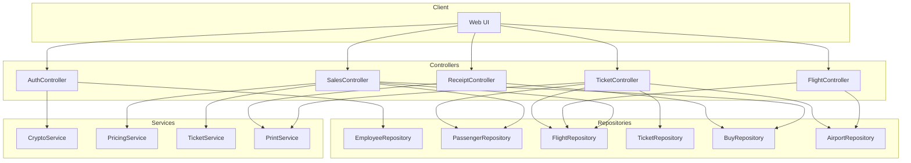
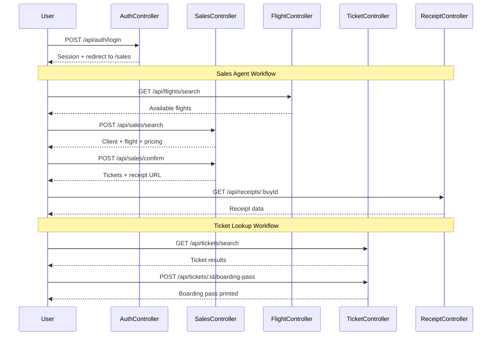

# Controllers Overview

This document provides an overview of all API controllers in the COBOL Airlines system.

## API Architecture

## Controllers

| Controller | Description | Endpoints |
|------------|-------------|-----------|
| [AuthController](./controllers/auth.md) | User authentication and session management | `POST /api/auth/login` |
| [SalesController](./controllers/sales.md) | Ticket sales workflow | `POST /api/sales/search` `POST /api/sales/confirm` |
| [FlightController](./controllers/flight.md) | Flight search operations | `GET /api/flights/search` |
| [TicketController](./controllers/ticket.md) | Ticket search and boarding pass generation | `GET /api/tickets/search` `POST /api/tickets/:ticketId/boarding-pass` |
| [ReceiptController](./controllers/receipt.md) | Receipt retrieval and printing | `GET /api/receipts/:buyId` `POST /api/receipts/:buyId/print` |

## User Flow

## Endpoint Summary

### Authentication
| Method | Endpoint | Description |
|--------|----------|-------------|
| POST | `/api/auth/login` | Authenticate user credentials |

### Sales
| Method | Endpoint | Description |
|--------|----------|-------------|
| POST | `/api/sales/search` | Search client and flight, calculate price |
| POST | `/api/sales/confirm` | Confirm passengers and complete purchase |

### Flights
| Method | Endpoint | Description |
|--------|----------|-------------|
| GET | `/api/flights/search` | Search available flights |

### Tickets
| Method | Endpoint | Description |
|--------|----------|-------------|
| GET | `/api/tickets/search` | Search existing tickets |
| POST | `/api/tickets/:ticketId/boarding-pass` | Print boarding pass |

### Receipts
| Method | Endpoint | Description |
|--------|----------|-------------|
| GET | `/api/receipts/:buyId` | Get receipt details |
| POST | `/api/receipts/:buyId/print` | Print receipt |
