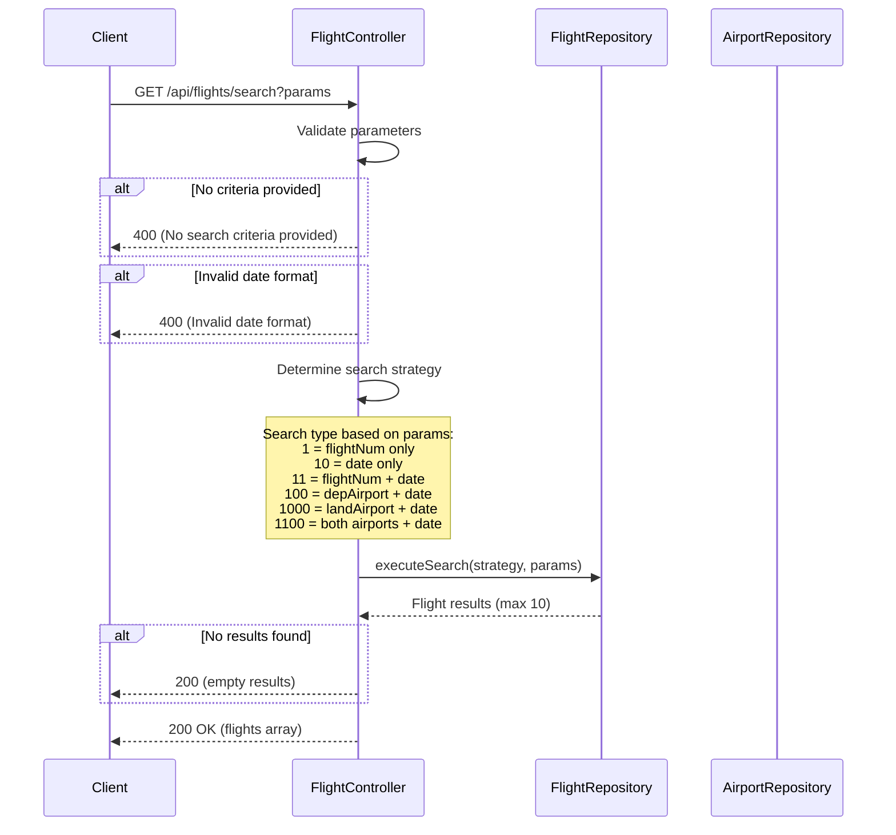

# FlightController

Provides flight search functionality with multiple filter criteria including flight number, date, departure airport, and arrival airport.

## Search Flights

- URL: `/api/flights/search`
- Method: GET
- Description: Search for available flights based on various criteria combinations
- Content Type: application/json
- View: [search-flight](../pages/search-flight.md)

### Data model
```ts
declare namespace SearchFlights {
  export namespace Request {
    interface Params {
      flightNum?: string;       // Flight number filter
      flightDate?: string;      // Date filter (YYYY-MM-DD)
      depAirport?: string;      // Departure airport code (3 chars)
      landAirport?: string;     // Arrival airport code (3 chars)
    }
  }

  export namespace Response {
    export interface Body {
      flights: Array<{
        flightId: string;
        depTime: string;
        landTime: string;
        depAirport: string;
        landAirport: string;
        availableSeats: number;
        flightDate: string;
      }>;
      totalResults: number;
      message?: string;
    }
  }
}
```

### Business Logic


### Relevant models
- [FLIGHT](../models/FLIGHT.md)
- [AIRPORT](../models/AIRPORT.md)
