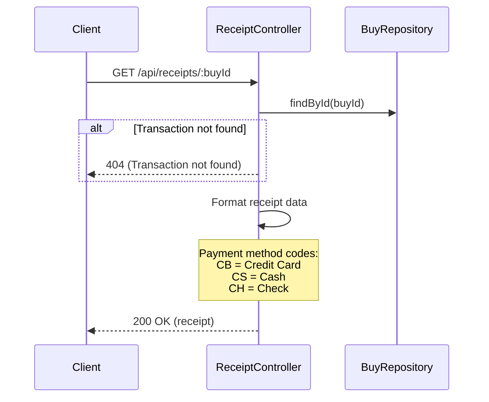
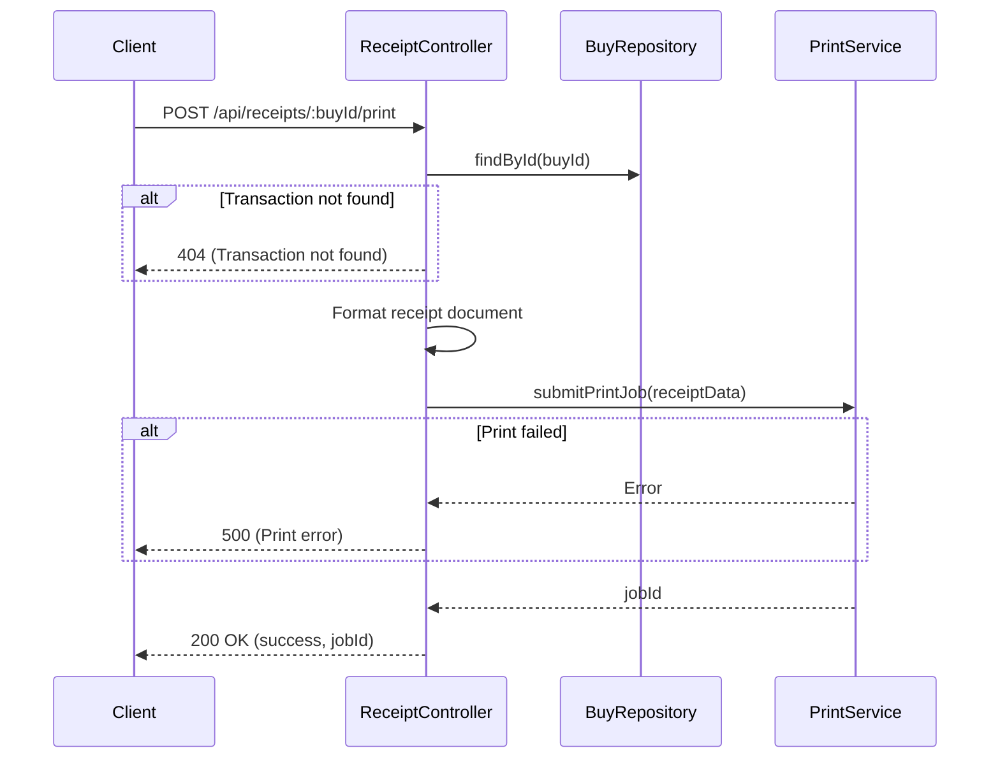

# ReceiptController

Handles receipt generation for completed ticket purchases. Receipts are generated automatically after successful sales transactions.

## Generate Receipt

- URL: `/api/receipts/:buyId`
- Method: GET
- Description: Retrieve or generate a receipt for a completed transaction
- Content Type: application/json
- View: [receipt](../pages/receipt.md)

### Data model
```ts
declare namespace GetReceipt {
  export namespace Request {
    interface Params {
      buyId: string;            // Transaction/Purchase ID
    }
  }

  export namespace Response {
    export interface Body {
      receipt: {
        buyId: string;
        paymentMethod: 'CB' | 'CS' | 'CH';  // Card, Cash, Check
        transactionDate: string;             // DD/MM/YYYY
        transactionTime: string;             // HH:MM:SS
        companyName: string;                 // "COBOL AIRLINES"
        city: string;                        // "PARIS"
        postalCode: string;                  // "75000"
        amount: number;                      // Amount in EUR
        transactionType: 'DEBIT' | 'CREDIT';
      };
    }
  }
}
```

### Business Logic


### Relevant models
- [BUY](../models/BUY.md)

---

## Print Receipt

- URL: `/api/receipts/:buyId/print`
- Method: POST
- Description: Send receipt to print queue
- Content Type: application/json
- View: [receipt](../pages/receipt.md)

### Data model
```ts
declare namespace PrintReceipt {
  export namespace Request {
    interface Params {
      buyId: string;            // Transaction/Purchase ID
    }
  }

  export namespace Response {
    export interface Body {
      success: boolean;
      jobId?: string;           // Print job ID
      message: string;
    }
  }
}
```

### Business Logic


### Relevant models
- [BUY](../models/BUY.md)
