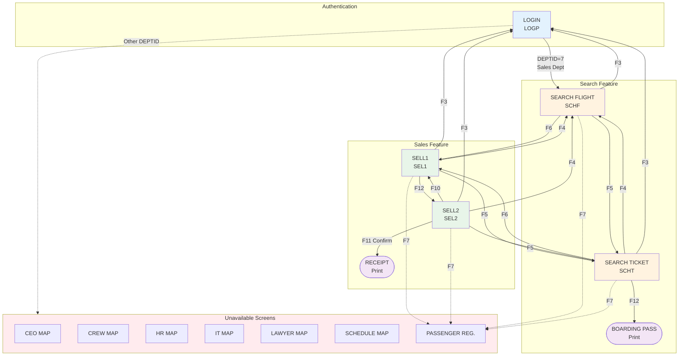

# COBOL Airlines - Screen Navigation

Overview of all screens in the COBOL Airlines system and their navigation relationships.

## Screen Inventory

| Screen | Transaction | Program | Description |
|--------|-------------|---------|-------------|
| LOGIN | LOGP | LOGIN-COB | User authentication |
| SELL1 | SEL1 | SELLCOB1 | Sales - client/flight selection |
| SELL2 | SEL2 | SELLCOB2 | Sales - passenger confirmation |
| SEARCH FLIGHT | SCHF | SRCHFLY-COB | Flight search |
| SEARCH TICKET | SCHT | SRCHTKT-COB | Ticket search |
| RECEIPT | - | RECEIPT-COB | Print: purchase receipt |
| BOARDING PASS | - | PRINT-TICKET-COB | Print: boarding pass |

## Navigation Flow

## Function Key Reference

| Key | Action |
|-----|--------|
| F3 | Exit / Return to LOGIN |
| F4 | Search Flight (SRCHFLI) |
| F5 | Search Ticket (SRCHTKT) |
| F6 | Sell (SELL1) |
| F7 | Passenger Registration (N/A) |
| F10 | Return / Previous Page |
| F11 | Next Page / Confirm |
| F12 | Insert Passengers / Print Ticket |

## Screen Details

- [LOGIN](./pages/login.md) - Authentication with department-based routing
- [SELL1](./pages/sell1.md) - Initial sales: client/flight selection
- [SELL2](./pages/sell2.md) - Passenger confirmation and sale finalization
- [SEARCH FLIGHT](./pages/search-flight.md) - Multi-criteria flight search
- [SEARCH TICKET](./pages/search-ticket.md) - Ticket lookup with pagination
- [RECEIPT](./pages/receipt.md) - Purchase receipt (print output)
- [BOARDING PASS](./pages/boarding-pass.md) - Ticket/boarding pass (print output)
