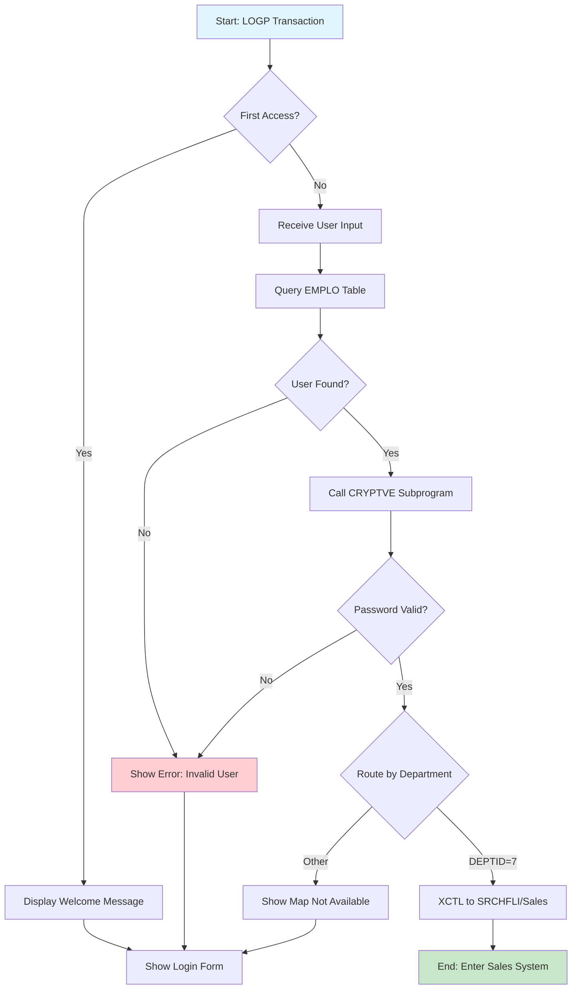

# LOGIN

User authentication screen for COBOL Airlines system. Allows employees to log in with their credentials and routes them to the appropriate department-specific interface based on their role.

## Data model
```ts
interface LoginData {
  userid: string;       // Employee ID (8 chars)
  password: string;     // Password (8 chars, encrypted)
  currentDate: string;  // System date (DD/MM/YYYY)
  currentTime: string;  // System time (HH:MM:SS)
  message1: string;     // Primary message area (70 chars)
  message2: string;     // Secondary message area (70 chars)
}
```

## Actions
- **login**: Authenticate user credentials against EMPLO table and route to department screen

## Layout
```html
<screen>
  <header>
    <title>LOGIN PAGE</title>
    <metadata>
      <date>{currentDate}</date>
      <time>{currentTime}</time>
    </metadata>
  </header>

  <main>
    <banner>
      <logo>COBOL AIRLINES</logo>
      <tagline>PROGRAMMING AT HEIGHTS</tagline>
    </banner>

    <form onsubmit="login">
      <field>
        <label>USERID</label>
        <input name="userid" type="text" />
      </field>
      <field>
        <label>PASSWORD</label>
        <input name="password" type="password" />
      </field>
    </form>
  </main>

  <footer>
    <messages>
      <message>{message1}</message>
      <message>{message2}</message>
    </messages>
  </footer>
</screen>
```

## Business Logic
```gherkin
Feature: User Authentication

Scenario: First time access
  Given the user has not started a session (EIBCALEN = 0)
  When the login screen is displayed
  Then show welcome message "WELCOME TO COBOL AIRLINES SYSTEM"
  And display current date and time

Scenario: Valid login credentials
  Given the user enters a valid USERID
  And the user enters the correct PASSWORD
  When the system verifies credentials against EMPLO table
  And the CRYPTVE subprogram validates the encrypted password
  Then the user is routed to their department-specific screen

Scenario: Invalid credentials
  Given the user enters invalid USERID or PASSWORD
  When the system verifies credentials
  Then display message "PASSWORD OR USERID INCORRECT."

Scenario: Database error
  Given a database communication error occurs
  When the system tries to verify credentials
  Then display message "COMMUNICATION ERROR IN THE SYSTEM CALL THE IT DEPT"
  And display the error code

Scenario: Department routing
  Given the user has valid credentials
  When login is successful
  Then route based on DEPTID:
    | DEPTID | Destination                    |
    | 1      | CEO MAP (not available)        |
    | 2,3,4  | CREW MAP (not available)       |
    | 5      | HR MAP (not available)         |
    | 6      | IT MAP (not available)         |
    | 7      | SALES MAP (SRCHFLI)            |
    | 8      | LAWYER MAP (not available)     |
    | 9      | SCHEDULE MAP (not available)   |
```

## Form validation
```ts
const schema = z4.object({
  userid: z4.string()
    .length(8, "USERID must be 8 characters")
    .regex(/^[A-Z0-9]+$/, "USERID must be alphanumeric"),
  password: z4.string()
    .length(8, "PASSWORD must be 8 characters")
});
```

## User Flow


## Relevant files
- [LOGIN-COB](../../COBOL-AIRLINES/CICS/LOGIN/LOGIN-COB) - Main COBOL program
- [LOGINMAP](../../COBOL-AIRLINES/CICS/LOGIN/LOGINMAP) - BMS map definition
- [LOGIN-DSPF](../../COBOL-AIRLINES/AS-400/DSPF/LOGIN-DSPF) - AS/400 display format
- [EMPLO](../../COBOL-AIRLINES/DB2/DCLGEN/EMPLO) - Employee table DCLGEN
