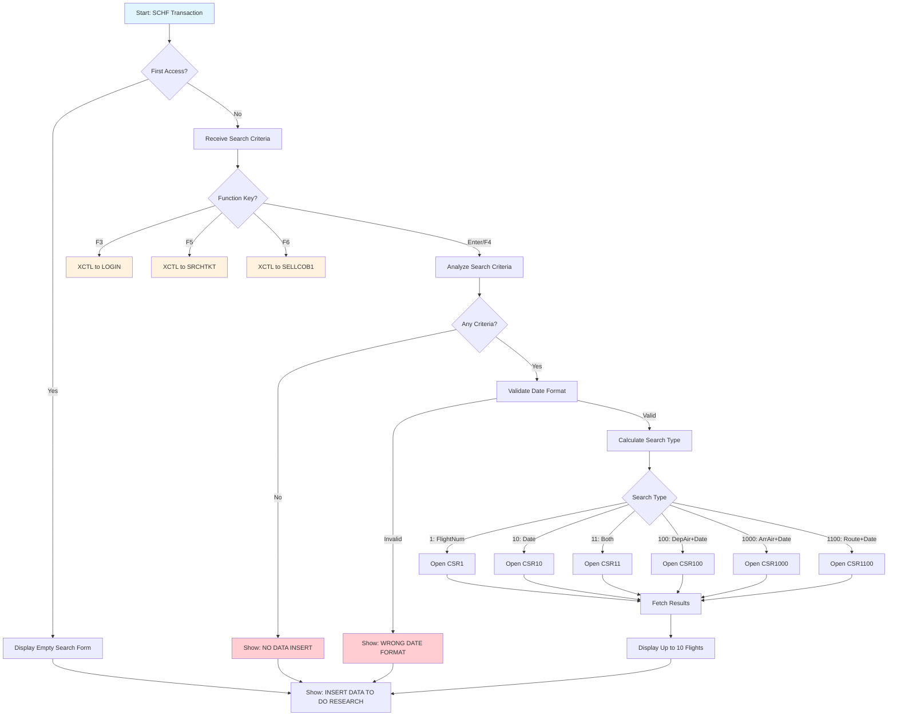

# SEARCH FLIGHT

Flight search screen allowing agents to find available flights by multiple criteria including flight number, date, departure airport, and arrival airport. Displays up to 10 matching flights in a tabular format.

## Data model
```ts
interface SearchFlightData {
  // Header info
  userid: string;
  terminal: string;
  currentDate: string;
  currentTime: string;

  // Search criteria (input)
  flightNum: string;        // Flight number filter
  flightDate: string;       // Date filter (YYYY-MM-DD)
  depAirport: string;       // Departure airport code (3 chars)
  landAirport: string;      // Arrival airport code (3 chars)

  // Search results (up to 10 flights)
  flights: Array<{
    flightId: string;       // Flight ID
    depTime: string;        // Departure time
    landTime: string;       // Landing time
    depAirport: string;     // Departure airport code
    landAirport: string;    // Landing airport code
    places: number;         // Available seats
    flightDate: string;     // Flight date
  }>;

  // Messages
  message1: string;
  message2: string;
}
```

## Actions
- **search**: Search flights based on criteria (flight number, date, airports)
- **exit**: Return to LOGIN screen
- **searchTicket**: Navigate to Ticket Search screen
- **sell**: Navigate to SELL1 screen

## Layout
```html
<screen>
  <header>
    <metadata>
      <userid>{userid}</userid>
      <terminal>{terminal}</terminal>
      <date>{currentDate}</date>
      <time>{currentTime}</time>
    </metadata>
    <title>COBOL AIRLINES - SEARCH FLIGHT</title>
  </header>

  <main>
    <section id="search-form">
      <form onsubmit="search">
        <field>
          <label>FLIGHT NUM</label>
          <input name="flightNum" type="text" />
        </field>
        <field>
          <label>DATE</label>
          <input name="flightDate" type="date" placeholder="YYYY-MM-DD" />
        </field>
        <field>
          <label>DEP AIRPORT</label>
          <input name="depAirport" type="text" maxlength="3" />
        </field>
        <field>
          <label>LAND AIRPORT</label>
          <input name="landAirport" type="text" maxlength="3" />
        </field>
      </form>
    </section>

    <section id="results">
      <table>
        <header>
          <column>FID</column>
          <column>TDEP</column>
          <column>TLAND</column>
          <column>DEP</column>
          <column>LAND</column>
          <column>PLACES</column>
          <column>DATE</column>
        </header>
        <rows repeat="10">
          <row>
            <value>{flights[].flightId}</value>
            <value>{flights[].depTime}</value>
            <value>{flights[].landTime}</value>
            <value>{flights[].depAirport}</value>
            <value>{flights[].landAirport}</value>
            <value>{flights[].places}</value>
            <value>{flights[].flightDate}</value>
          </row>
        </rows>
      </table>
    </section>

    <section id="actions">
      <button onclick="exit">F3: EXIT</button>
      <button onclick="search">F4: SEARCH FLIGHT</button>
      <button onclick="searchTicket">F5: SEARCH TICKET</button>
      <button onclick="sell">F6: SELL</button>
    </section>
  </main>

  <footer>
    <messages>
      <message>{message1}</message>
      <message>{message2}</message>
    </messages>
  </footer>
</screen>
```

## Business Logic
```gherkin
Feature: Flight Search

Scenario: Search by flight number only
  Given the agent enters only FLIGHT NUM
  When the search is executed
  Then query FLIGHT table using CSR1 cursor
  And return flights matching the number

Scenario: Search by date only
  Given the agent enters only DATE
  When the search is executed
  Then query FLIGHT table using CSR10 cursor
  And return all flights on that date

Scenario: Search by flight number and date
  Given the agent enters FLIGHT NUM and DATE
  When the search is executed
  Then query FLIGHT table using CSR11 cursor
  And return exact match

Scenario: Search by departure airport and date
  Given the agent enters DEP AIRPORT and DATE
  When the search is executed
  Then query FLIGHT table using CSR100 cursor
  And return flights departing from that airport

Scenario: Search by arrival airport and date
  Given the agent enters LAND AIRPORT and DATE
  When the search is executed
  Then query FLIGHT table using CSR1000 cursor
  And return flights arriving at that airport

Scenario: Search by both airports and date
  Given the agent enters DEP AIRPORT, LAND AIRPORT, and DATE
  When the search is executed
  Then query FLIGHT table using CSR1100 cursor
  And return flights matching the route

Scenario: No search criteria
  Given the agent enters no search criteria
  When the search is executed
  Then display message "NO DATA INSERT, TRY AGAIN"

Scenario: Invalid date format
  Given the agent enters an invalid date format
  When the search is executed
  Then display message "WRONG DATE FORMAT, TRY TO INSERT DATE AS YYYY-MM-DD"

Scenario: Database error
  Given a database error occurs during search
  When the error is caught
  Then display "DB2 ERROR, CALL THE IT DEPARTMENT"
  And show SQLCODE and SQLSTATE
```

## Form validation
```ts
const schema = z4.object({
  flightNum: z4.string().optional(),
  flightDate: z4.string()
    .regex(/^\d{4}-\d{2}-\d{2}$/, "DATE must be YYYY-MM-DD format")
    .optional(),
  depAirport: z4.string()
    .length(3, "Airport code must be 3 characters")
    .regex(/^[A-Z]{3}$/, "Airport code must be uppercase letters")
    .optional(),
  landAirport: z4.string()
    .length(3, "Airport code must be 3 characters")
    .regex(/^[A-Z]{3}$/, "Airport code must be uppercase letters")
    .optional()
}).refine(
  data => data.flightNum || data.flightDate || data.depAirport || data.landAirport,
  "At least one search criterion is required"
);
```

## User Flow


## Relevant files
- [SRCHFLY-COB](../../COBOL-AIRLINES/CICS/SALES-MAP/SRCHFLY-COB) - Main COBOL program
- [SRCHFLI-MAP](../../COBOL-AIRLINES/CICS/SALES-MAP/SRCHFLI-MAP) - BMS map definition
- [FLIGHT](../../COBOL-AIRLINES/DB2/DCLGEN/FLIGHT) - Flight table DCLGEN
- [AIRPORT](../../COBOL-AIRLINES/DB2/DCLGEN/AIRPORT) - Airport table DCLGEN
