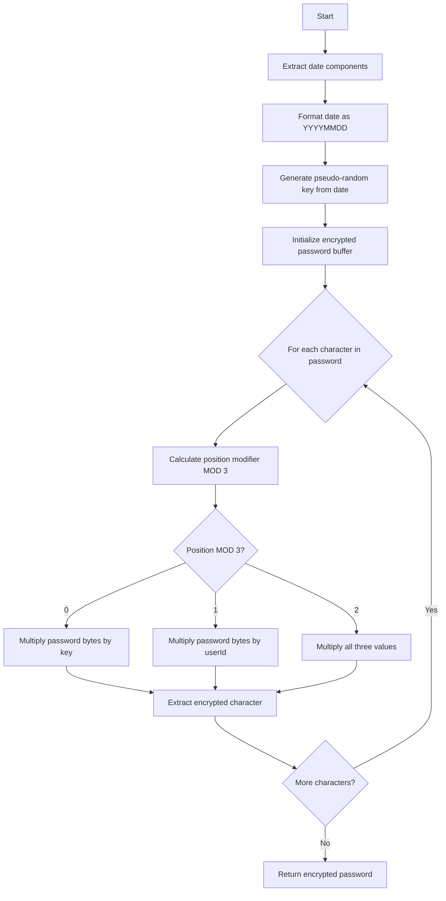
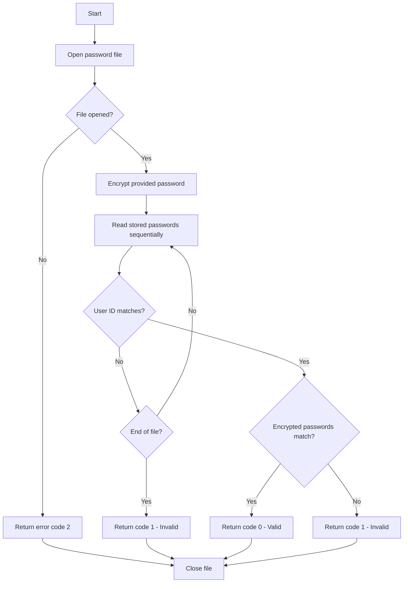

# CryptoService

Handles password encryption and verification for user authentication. Uses a deterministic encryption algorithm based on user ID, admin date, and a pseudo-random key seeded from the date.

## Methods

### encryptPassword

Encrypts a plain-text password for storage or comparison during authentication.

#### Signature
```ts
interface EncryptPasswordInput {
  password: string;   // Plain-text password (8 chars max)
  userId: string;     // Employee/User ID (8 chars)
  adminDate: string;  // Administration date (DD/MM/YYYY or YYYY-MM-DD)
}

interface EncryptPasswordOutput {
  encryptedPassword: string;  // Encrypted password (8 chars)
}

function encryptPassword(input: EncryptPasswordInput): Promise<EncryptPasswordOutput>
```

#### Business Logic


#### Error Handling
| Error Code | Condition | Message |
|------------|-----------|---------|
| FILE_ACCESS_ERROR | Cannot open password storage file | ERROR TO ACCESS THE PASSWORD STORAGE |
| WRITE_ERROR | Cannot write to password file | ERROR TO WRITE |

---

### verifyPassword

Verifies a provided password against the stored encrypted password.

#### Signature
```ts
interface VerifyPasswordInput {
  password: string;   // Plain-text password to verify
  userId: string;     // Employee/User ID
  adminDate: string;  // Administration date from employee record
}

interface VerifyPasswordOutput {
  isValid: boolean;   // True if password matches
  errorCode?: number; // 0=OK, 1=Invalid, 2=System Error
  errorMessage?: string;
}

function verifyPassword(input: VerifyPasswordInput): Promise<VerifyPasswordOutput>
```

#### Business Logic


#### Error Handling
| Error Code | Condition | Message |
|------------|-----------|---------|
| 0 | Password verified successfully | (none) |
| 1 | User not found or password mismatch | PASSWORD OR USERID INCORRECT |
| 2 | System/file error | COMMUNICATION ERROR IN THE SYSTEM |

## Dependencies
- None (standalone cryptographic service)

## Relevant files
- [EMPLO-CRYPTO-PASS](../../COBOL-AIRLINES/COB-PROG/EMPLO-INSERT/EMPLO-CRYPTO-PASS) - Password encryption program
- [CRYPTO-VERIFICATION](../../COBOL-AIRLINES/CICS/LOGIN/CRYPTO-VERIFICATION) - Password verification program
- [LOGIN-COB](../../COBOL-AIRLINES/CICS/LOGIN/LOGIN-COB) - Login program that calls crypto service
