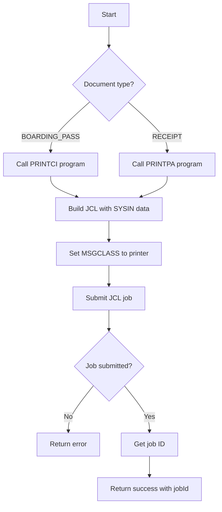
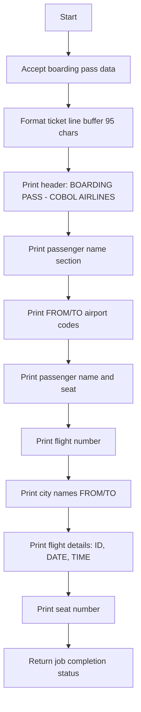
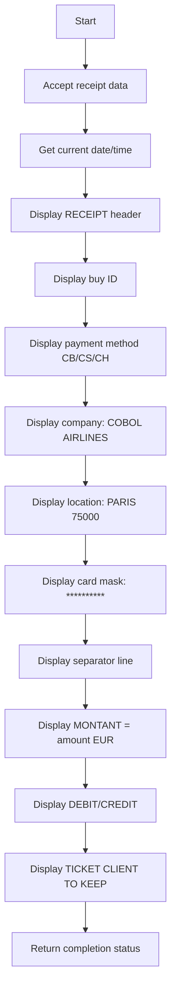

# PrintService

Handles document printing through JCL batch job submission. Supports printing boarding passes, receipts, and other formatted documents to configured printer queues.

## Methods

### submitPrintJob

Submits a document to the print queue via JCL job submission.

#### Signature
```ts
interface SubmitPrintJobInput {
  documentType: 'BOARDING_PASS' | 'RECEIPT';
  documentData: Record<string, string>;  // Document fields to print
  printerClass?: string;    // JCL MSGCLASS for printer selection
}

interface SubmitPrintJobOutput {
  jobId: string;            // JCL job ID
  success: boolean;
  message: string;
}

function submitPrintJob(input: SubmitPrintJobInput): Promise<SubmitPrintJobOutput>
```

#### Business Logic


#### Error Handling
| Error Code | Condition | Message |
|------------|-----------|---------|
| JOB_SUBMIT_ERROR | JCL submission failed | Print job submission failed |
| INVALID_DOCUMENT | Unknown document type | Invalid document type |
| PRINTER_UNAVAILABLE | Printer queue offline | Printer not available |

---

### printBoardingPass

Prints a boarding pass document for a specific ticket.

#### Signature
```ts
interface PrintBoardingPassInput {
  fullName: string;        // Passenger full name (45 chars)
  seatNumber: string;      // Seat assignment (3 chars, e.g., "12A")
  flightNum: string;       // Flight number (6 chars)
  depAirport: string;      // Departure airport code (3 chars)
  arrAirport: string;      // Arrival airport code (3 chars)
  flightDate: string;      // Flight date (10 chars, YYYY-MM-DD)
  departureTime: string;   // Departure time (5 chars, HH:MM)
  formattedDate: string;   // Date for display (9 chars, DDMMMYYYY)
  depCityName: string;     // Departure city name (20 chars)
  arrCityName: string;     // Arrival city name (20 chars)
}

interface PrintBoardingPassOutput {
  jobId: string;
  success: boolean;
  message: string;
}

function printBoardingPass(input: PrintBoardingPassInput): Promise<PrintBoardingPassOutput>
```

#### Business Logic


#### Boarding Pass Layout
```
|
BOARDING PASS               COBOL AIRLINES|
                                          |  FIRSTNAME LASTNAME
PASSENGER NAME              SEAT          |  FROM: XXX TO: XXX
FIRSTNAME LASTNAME          12A           |
                                          |  FLIGHT: XXXXXX
FROM: CITY NAME             TO: CITY NAME |
                                          |  DATE: YYYY-MM-DD
FLIGHTID: XXXXXX  DATE: DDMMMYYYY  TIME: HH:MM |  SEAT: XXA
                                          |
```

---

### printReceipt

Prints a receipt document for a completed transaction.

#### Signature
```ts
interface PrintReceiptInput {
  buyId: string;           // Transaction ID
  totalPrice: number;      // Total amount
}

interface PrintReceiptOutput {
  jobId: string;
  success: boolean;
  message: string;
}

function printReceipt(input: PrintReceiptInput): Promise<PrintReceiptOutput>
```

#### Business Logic


#### Receipt Layout
```
           RECEIPT

$$$$$9.99
CB/CS/CH
COBOL AIRLINES
PARIS
75000
**********
------------------------------

MONTANT = 99999.99  EUR

DEBIT/CREDIT

     TICKET CLIENT
        TO KEEP
```

## Dependencies
- None (standalone print service using JCL)

## Relevant files
- [PRINT-TICKET-COB](../../COBOL-AIRLINES/CICS/SALES-MAP/PRINT-TICKET-COB) - Boarding pass print program (PRINTCI)
- [RECEIPT-COB](../../COBOL-AIRLINES/CICS/SALES-MAP/RECEIPT-COB) - Receipt print program (PRINTPA)
