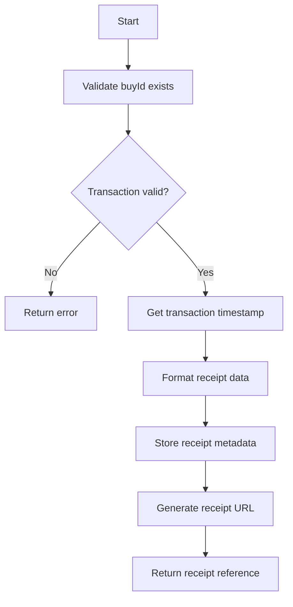
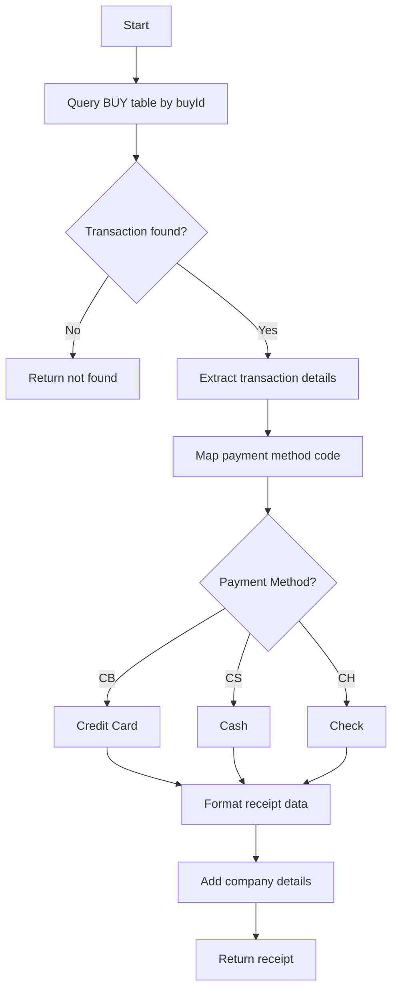
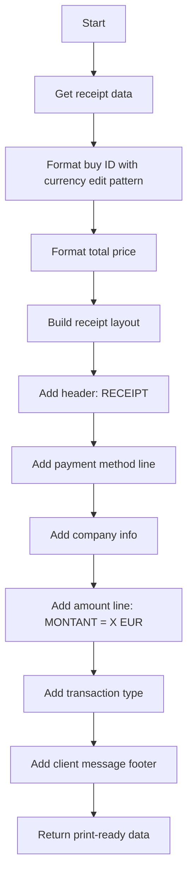

# ReceiptService

Generates and formats receipts for completed ticket purchase transactions. Provides receipt data retrieval and formatting for display and printing.

## Methods

### generateReceipt

Creates a receipt record for a completed purchase transaction.

#### Signature
```ts
interface GenerateReceiptInput {
  buyId: string;           // Transaction/Purchase ID
  totalAmount: number;     // Total purchase amount
  paymentMethod: 'CB' | 'CS' | 'CH';  // Card, Cash, Check
  ticketIds: string[];     // Associated ticket IDs
}

interface GenerateReceiptOutput {
  receiptId: string;       // Receipt identifier (same as buyId)
  receiptUrl: string;      // URL to access receipt
  success: boolean;
}

function generateReceipt(input: GenerateReceiptInput): Promise<GenerateReceiptOutput>
```

#### Business Logic


#### Error Handling
| Error Code | Condition | Message |
|------------|-----------|---------|
| TRANSACTION_NOT_FOUND | Buy ID doesn't exist | Transaction not found |
| INVALID_AMOUNT | Amount is negative or zero | Invalid transaction amount |

---

### getReceipt

Retrieves receipt details for a completed transaction.

#### Signature
```ts
interface GetReceiptInput {
  buyId: string;           // Transaction/Purchase ID
}

interface GetReceiptOutput {
  receipt: {
    buyId: string;
    paymentMethod: 'CB' | 'CS' | 'CH';
    paymentMethodLabel: string;  // "Credit Card", "Cash", "Check"
    transactionDate: string;     // DD/MM/YYYY format
    transactionTime: string;     // HH:MM:SS format
    companyName: string;         // "COBOL AIRLINES"
    city: string;                // "PARIS"
    postalCode: string;          // "75000"
    amount: number;              // Amount in EUR
    transactionType: 'DEBIT' | 'CREDIT';
  };
  found: boolean;
}

function getReceipt(input: GetReceiptInput): Promise<GetReceiptOutput>
```

#### Business Logic


#### Error Handling
| Error Code | Condition | Message |
|------------|-----------|---------|
| TRANSACTION_NOT_FOUND | Buy ID doesn't exist | Transaction not found |

---

### formatReceiptForPrint

Formats receipt data for printing via JCL batch job.

#### Signature
```ts
interface FormatReceiptForPrintInput {
  buyId: string;
}

interface FormatReceiptForPrintOutput {
  printData: {
    buyIdFormatted: string;    // Formatted buy ID with currency symbol
    totalPrice: string;        // Formatted price (9999.99 EUR)
    paymentMethod: string;     // CB/CS/CH
    companyHeader: string;     // "COBOL AIRLINES"
    locationInfo: string;      // "PARIS 75000"
    transactionType: string;   // "DEBIT" or "CREDIT"
    clientMessage: string;     // "TICKET CLIENT TO KEEP"
  };
}

function formatReceiptForPrint(input: FormatReceiptForPrintInput): Promise<FormatReceiptForPrintOutput>
```

#### Business Logic


## Dependencies
- [BuyRepository](../models/BUY.md)
- [PrintService](./print-service.md)

## Relevant files
- [RECEIPT-COB](../../COBOL-AIRLINES/CICS/SALES-MAP/RECEIPT-COB) - Receipt generation program
- [RECEIPT-FORMAT](../../COBOL-AIRLINES/CICS/SALES-MAP/RECEIPT-FORMAT) - Receipt format definitions
