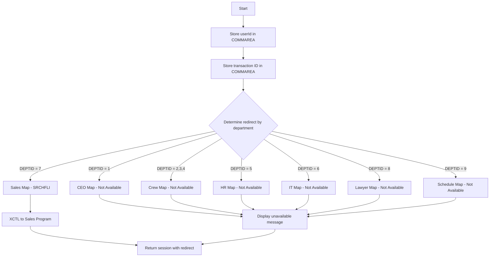
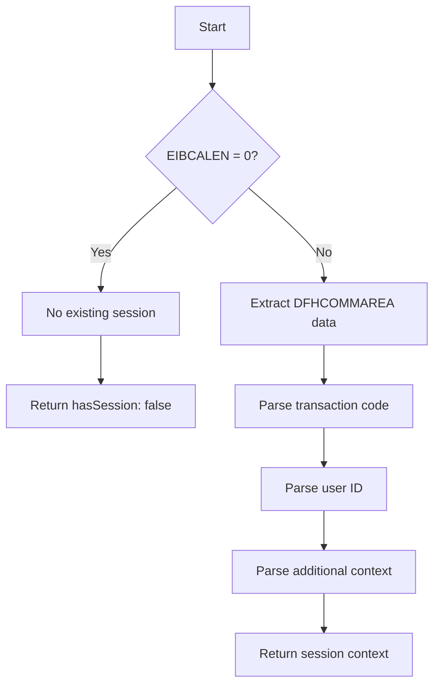

# SessionService

Manages user sessions using CICS pseudo-conversational model. Sessions are maintained through DFHCOMMAREA (communication area) passed between transaction invocations.

## Methods

### createSession

Creates a new session after successful authentication, storing user context in the communication area.

#### Signature
```ts
interface CreateSessionInput {
  userId: string;       // Authenticated user's employee ID
  departmentId: number; // User's department ID (determines routing)
  transactionId: string; // CICS transaction ID
}

interface CreateSessionOutput {
  sessionData: {
    transaction: string;  // Transaction code (4 chars)
    userId: string;       // User ID (8 chars)
  };
  redirectPath: string;   // Path to redirect user based on department
}

function createSession(input: CreateSessionInput): Promise<CreateSessionOutput>
```

#### Business Logic


#### Error Handling
| Error Code | Condition | Message |
|------------|-----------|---------|
| DEPT_UNAVAILABLE | Department map not implemented | THE {DEPT} MAP IS NOT AVAILABLE YET |

---

### getSessionContext

Retrieves the current session context from DFHCOMMAREA during pseudo-conversational processing.

#### Signature
```ts
interface GetSessionContextInput {
  commAreaLength: number;  // EIBCALEN - length of communication area
}

interface GetSessionContextOutput {
  hasSession: boolean;
  context?: {
    transaction: string;
    userId: string;
    flightId?: number;
    clientId?: number;
    additionalData?: Record<string, any>;
  };
}

function getSessionContext(input: GetSessionContextInput): Promise<GetSessionContextOutput>
```

#### Business Logic


#### Error Handling
| Error Code | Condition | Message |
|------------|-----------|---------|
| NO_SESSION | EIBCALEN is 0 | (First invocation - no prior session) |

## Dependencies
- None (uses CICS built-in COMMAREA mechanism)

## Relevant files
- [LOGIN-COB](../../COBOL-AIRLINES/CICS/LOGIN/LOGIN-COB) - Login program managing sessions
- [SELL1-COB](../../COBOL-AIRLINES/CICS/SALES-MAP/SELL1-COB) - Sales program using session context
