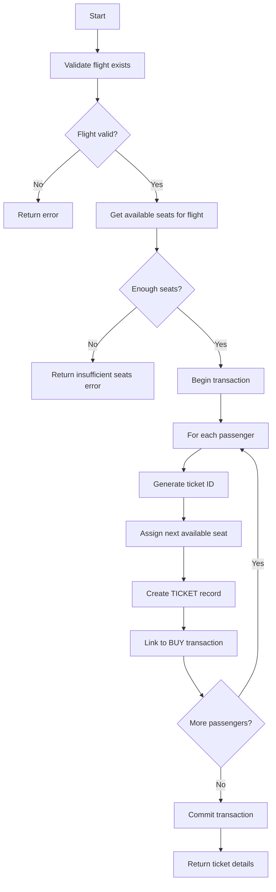
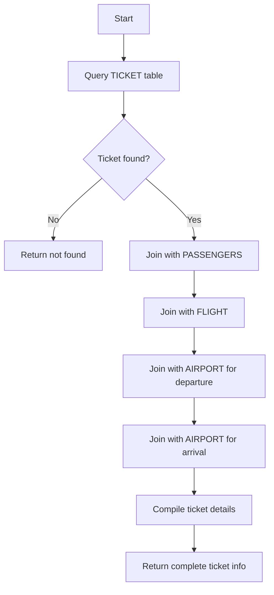
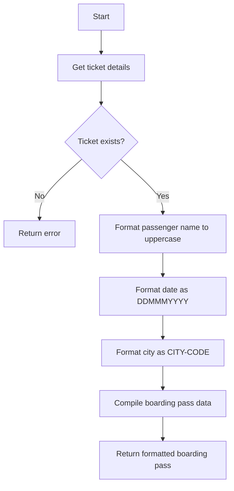

# TicketService

Manages ticket creation, seat assignment, and ticket lifecycle for flight bookings. Handles the generation of ticket records linked to passengers, flights, and purchase transactions.

## Methods

### createTickets

Creates ticket records for a confirmed booking, assigning seat numbers to each passenger.

#### Signature
```ts
interface CreateTicketsInput {
  flightId: number;        // Flight identifier
  flightNum: string;       // Flight number
  flightDate: string;      // Flight date (YYYY-MM-DD)
  passengers: Array<{
    clientId: string;      // Passenger ID
    firstName: string;     // Passenger first name
    lastName: string;      // Passenger last name
  }>;
  buyId: string;           // Transaction/Purchase ID to link tickets
}

interface CreateTicketsOutput {
  tickets: Array<{
    ticketId: string;      // Generated ticket ID
    clientId: string;      // Passenger ID
    passengerName: string; // Full passenger name
    seatNumber: string;    // Assigned seat (e.g., "12A")
  }>;
  success: boolean;
}

function createTickets(input: CreateTicketsInput): Promise<CreateTicketsOutput>
```

#### Business Logic


#### Error Handling
| Error Code | Condition | Message |
|------------|-----------|---------|
| FLIGHT_NOT_FOUND | Flight doesn't exist | Flight does not exist |
| PASSENGER_NOT_FOUND | Passenger ID invalid | Passenger X does not exist |
| INSUFFICIENT_SEATS | Not enough seats available | Not enough seats available |
| DB_ERROR | Database operation failed | System error - contact IT |

---

### getTicketDetails

Retrieves complete ticket information including passenger and flight details.

#### Signature
```ts
interface GetTicketDetailsInput {
  ticketId: string;        // Ticket identifier
}

interface GetTicketDetailsOutput {
  ticket: {
    ticketId: string;
    passengerName: string;
    firstName: string;
    lastName: string;
    seatNumber: string;
    flightId: string;
    flightNum: string;
    flightDate: string;
    depTime: string;
    landTime: string;
    depAirportCode: string;
    arrAirportCode: string;
    depCityName: string;
    arrCityName: string;
  };
  found: boolean;
}

function getTicketDetails(input: GetTicketDetailsInput): Promise<GetTicketDetailsOutput>
```

#### Business Logic


#### Error Handling
| Error Code | Condition | Message |
|------------|-----------|---------|
| TICKET_NOT_FOUND | Ticket ID doesn't exist | Ticket not found |

---

### formatBoardingPass

Formats ticket data for boarding pass generation and printing.

#### Signature
```ts
interface FormatBoardingPassInput {
  ticketId: string;
}

interface FormatBoardingPassOutput {
  boardingPass: {
    passengerName: string;    // "FIRSTNAME LASTNAME" format
    seatNumber: string;       // "12A" format
    flightId: string;
    flightDate: string;       // "DDMMMYYYY" format (e.g., "15DEC2024")
    departureTime: string;    // "HH:MM" format
    depAirportCode: string;   // 3-char IATA code
    arrAirportCode: string;   // 3-char IATA code
    depCityName: string;      // "CITY-CODE" format
    arrCityName: string;      // "CITY-CODE" format
  };
}

function formatBoardingPass(input: FormatBoardingPassInput): Promise<FormatBoardingPassOutput>
```

#### Business Logic


## Dependencies
- [PassengerRepository](../models/PASSENGERS.md)
- [FlightRepository](../models/FLIGHT.md)
- [AirportRepository](../models/AIRPORT.md)
- [BuyRepository](../models/BUY.md)

## Relevant files
- [SELL1-COB](../../COBOL-AIRLINES/CICS/SALES-MAP/SELL1-COB) - Sales flow handling ticket creation
- [SRCHTKT-COB](../../COBOL-AIRLINES/CICS/SALES-MAP/SRCHTKT-COB) - Ticket search program
- [TICKET-FORMAT](../../COBOL-AIRLINES/CICS/SALES-MAP/TICKET-FORMAT) - Ticket formatting definitions
